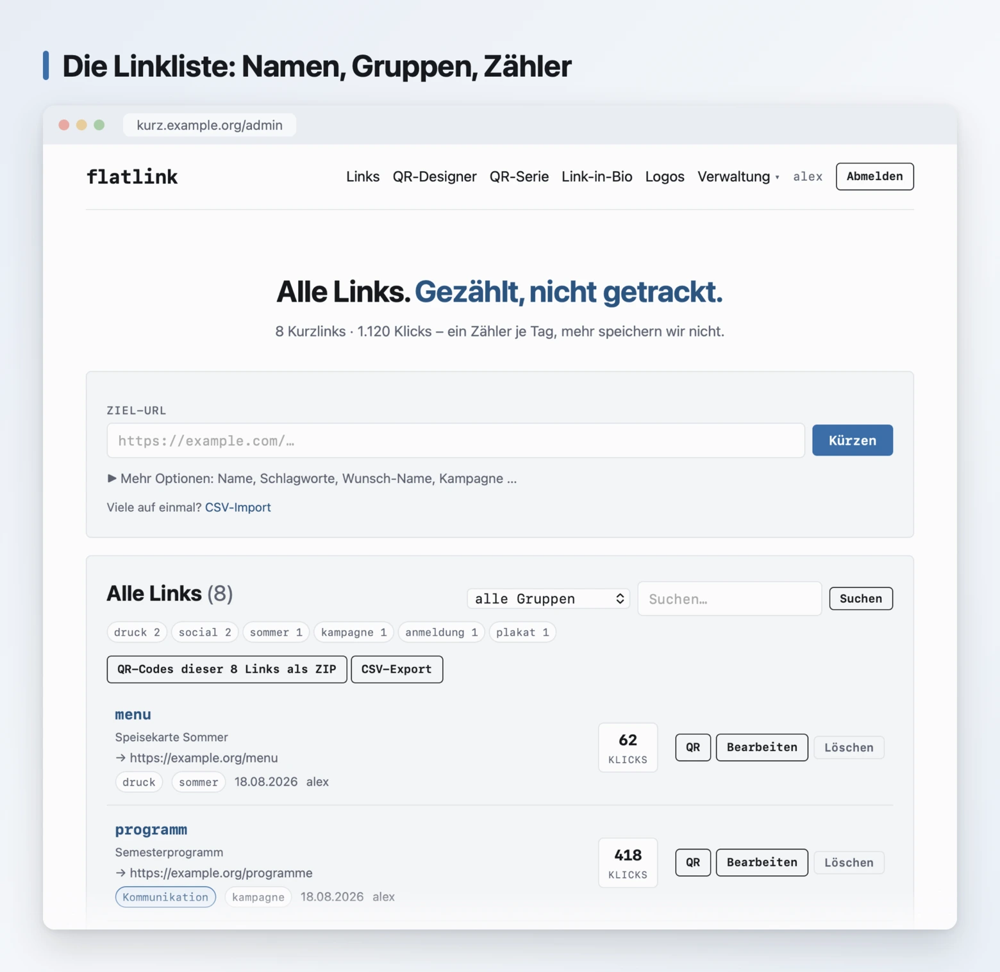
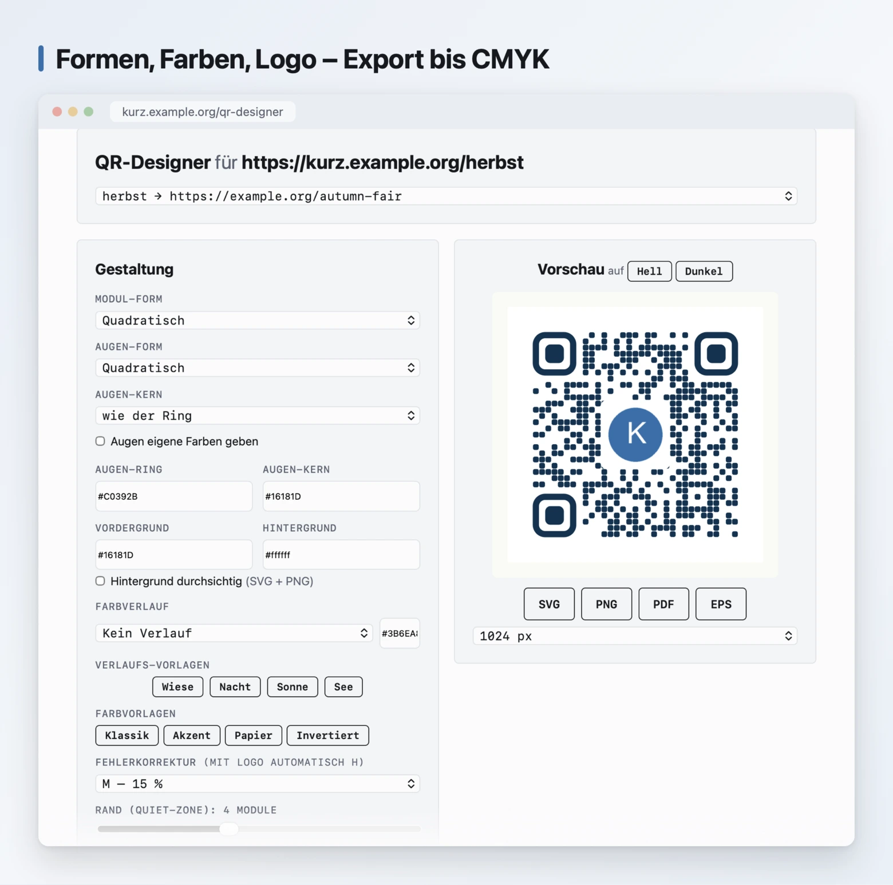
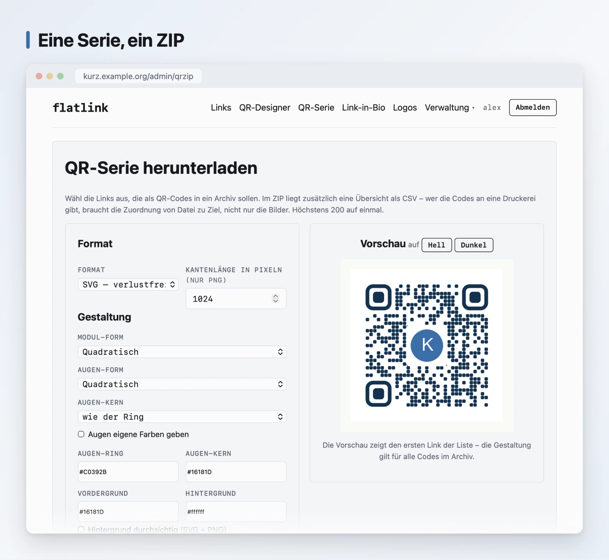
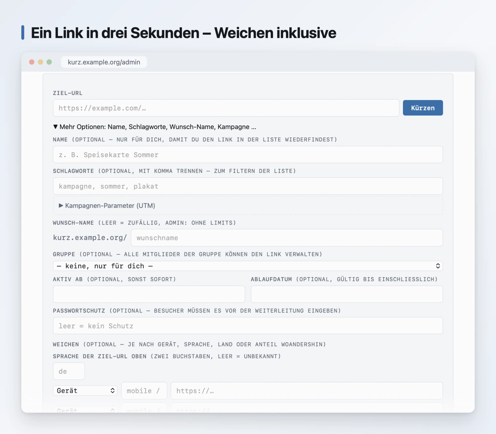
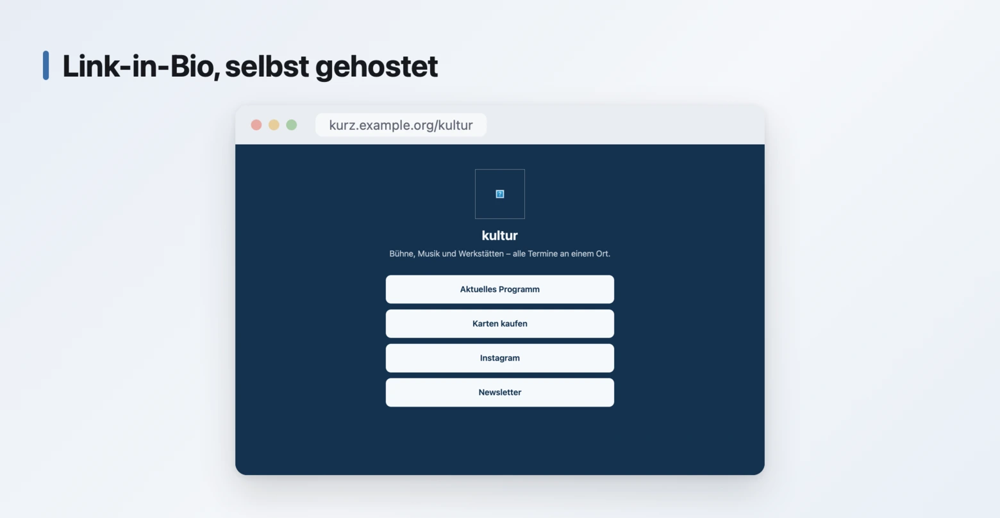
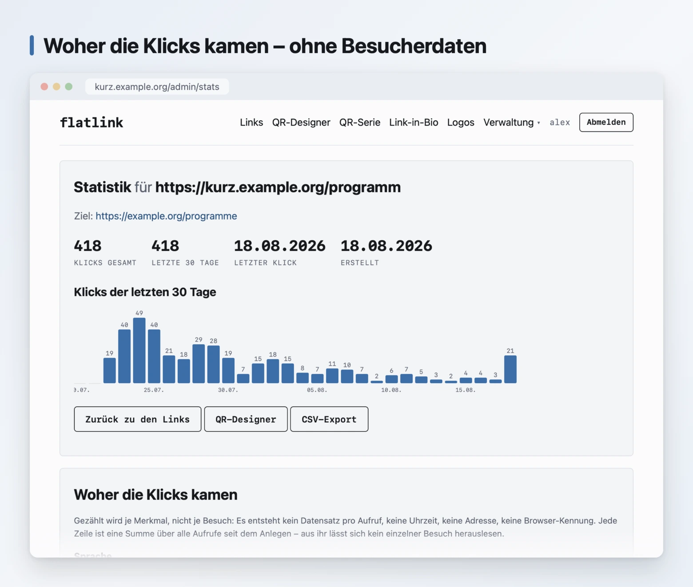

<h1 align="center">flatlink</h1>

<p align="center"> <strong>Der Kurzlink-Dienst zum Selbstbetreiben – mit
QR-Designer und Link-in-Bio.</strong><br> Reines PHP. Kein Datenbank-Server,
kein Composer, kein Build-Schritt –<br> Dateien auf einen Webspace kopieren,
fertig. </p>

<p align="center"> <a href="LICENSE"></a>    </p>

<p align="center">  </p>

> 🇬🇧 English version: **[README.md](README.md)** – the manual chapters
> are translated as well.

---

## Was flatlink ist

Ein Kurzlink-Dienst, den du selbst betreibst: Links kürzen, QR-Codes bis zur
Druckerei erzeugen, Link-in-Bio-Seiten bauen – auf deiner Domain, in deinem
Haus. Reines PHP, kein Datenbank-Server, kein Composer, kein Build-Schritt.

Gebaut ist er für Hochschulen, Bibliotheken und Verwaltungen, die ihre Links
nicht aus dem Haus geben dürfen. Deshalb sind Anmeldung über LDAP und
Shibboleth, Gruppen mit Rechten und Limits, Namensräume je Abteilung und
mehrere Domains kein Anbau, sondern Kern.

Und er zählt Besuche, ohne Besucher zu erfassen: keine IP-Adressen, keine
Datensätze je Aufruf, keine Profile – [nachprüfbar im
Quelltext](#was-nicht-gespeichert-wird), nicht nur behauptet.

## Funktionen

### Kurzlinks

| | |
| --- | --- |
| **Code** | zufällig oder selbst gewählt, mit Mindestlänge und Kontingent gegen das Besetzen kurzer Namen |
| **Ordnung** | Name für die eigene Übersicht, bis zu acht Schlagwörter, Filter und Suche über den Bestand |
| **Zeitfenster** | Startdatum (Code drucken, bevor das Ziel steht) und Ablaufdatum |
| **Aufruf-Limit** | „nur die ersten 50“ – danach antwortet der Link mit 410 |
| **Schutz** | Passwort vor der Weiterleitung, Sperren einzelner Links |
| **Weichen** | ein Link, mehrere Ziele – nach Gerät, Sprache, Land oder Anteil (A/B). Die Sprachweiche verhandelt gegen die Sprache des Ziels, ohne dabei etwas zu speichern |
| **Kampagnen** | Baukasten für `utm_*`-Parameter mit Vorschlägen aus dem Bestand |
| **Umzug** | CSV-Import aus Bitly, YOURLS, Shlink und Kutt – Kurzcodes bleiben erhalten; CSV-Export im selben Format |
| **Mehrere Domains** | je Kunde oder Einrichtung eine eigene, in einer Instanz |

### QR-Codes

| | |
| --- | --- |
| **Eigener Encoder** | ISO/IEC 18004, Byte-Mode, Versionen 1–40, alle vier Fehlerkorrektur-Stufen – ohne jede Fremdbibliothek, geprüft mit einem fremden Decoder über alle 160 Kombinationen |
| **Designer** | sieben Modulformen, vier Augenformen (Ring und Kern getrennt), freie Farben, Farbverläufe, Rahmen mit Text |
| **Logo** | aus einer Bibliothek mit Freigabe an Gruppen; Module unter dem Logo entfallen ganz, statt angeschnitten zu werden |
| **Fünf Typen** | Adresse/Kurzlink, WLAN-Zugang, Kontakt (vCard), Termin (iCalendar), GS1 Digital Link – die vier letzten ohne jede Speicherung |
| **Druck** | SVG, PNG, Vektor-PDF und EPS, wahlweise in CMYK – das Format, nach dem Druckereien fragen |
| **Serien** | zwanzig Codes in einem ZIP, mit Übersicht als CSV |
| **Lesbarkeitsprüfung** | Kontrast, Ruhezone, Logo-Anteil und Modulgröße, live beim Gestalten |

### Link-in-Bio

Eine Seite mit mehreren Zielen unter einem Kurzcode – für das Profil im
sozialen Netz, den Aufkleber am Schaufenster. Eigene Farben und Logo,
Impressum und Datenschutz im Fuß (eigene Angaben oder die der Instanz).
Gezählt wird je Tag, für die Seite und je Ziel.

### Statistik ohne Besucherprofile

| | |
| --- | --- |
| **Was gezählt wird** | Aufrufe gesamt und je Kalendertag, dazu Herkunft, Gerätegattung und Sprache **als Summen** |
| **Was nicht zählt** | bekannte Bots, HEAD-Anfragen und der angemeldete Besitzer selbst |
| **Was fehlt** | Uhrzeiten, IP-Adressen, Datensätze je Aufruf, Wiedererkennung – es gibt sie nicht, also auch nicht in der API |
| **Abschaltbar** | `'click_dims' => false` lässt nur die reinen Zähler übrig |
| **Export** | CSV je Link und über den ganzen Bestand |

### Konten, Gruppen, Anmeldung

| | |
| --- | --- |
| **Konten** | Selbstregistrierung per Double-Opt-In, Passwort-Reset, Rollen, Limits je Konto |
| **Zwei Faktoren** | Passkeys (WebAuthn) und Einmalkennwörter (TOTP), instanzweit erzwingbar |
| **Zentrale Anmeldung** | LDAP und Active Directory mit Verzeichnissuche; Shibboleth, SAML und OpenID Connect über den Webserver |
| **Gruppen** | als Rechtegruppe (Berechtigungen und Limits) oder Arbeitsgruppe (das Team verwaltet die Links gemeinsam) |
| **Namensräume** | Präfix je Abteilung – `/bib/oeffnungszeiten` gehört der Bibliothek |
| **Selbstauskunft** | Datenexport und Löschknopf im Profil, Art. 15/17/20 DSGVO ohne Ticketsystem |
| **Sitzungen** | Liste der aktiven Anmeldungen, einzeln oder alle anderen beenden |

### Betrieb

| | |
| --- | --- |
| **Installation** | Dateien kopieren – oder ein Container-Image für amd64 und arm64 |
| **Sicherung** | ein Knopf, der Datenbank, Einstellungen, Zähler und Logos als ZIP ausgibt; dazu ein Textexport für versionierbare Sicherungen |
| **Schnittstelle** | Links, Schlagwörter und ein Gesundheitsendpunkt fürs Monitoring, mit Zugangsschlüsseln je Konto |
| **Browser-Erweiterung** | „diese Seite kürzen“ für Chrome und Firefox, gegen die eigene Instanz |
| **Missbrauchsschutz** | Rate-Limits, Meldeformular, Sperrfunktion, optional Google Safe Browsing samt Wiederholungslauf über den Bestand |
| **Protokoll** | wer wann was verwaltet hat – nur Verwaltung, nie Besucher |
| **Aufräumen** | nie aufgerufene Links nach N Jahren, mit Vorwarnung per Mail (aus Vorgabe) |
| **Demo-Modus** | öffentliche Spielwiese, die sich selbst zurücksetzt – ohne Cron |
| **Zweisprachig** | Oberfläche auf Deutsch oder Englisch, umschaltbar zur Laufzeit |
| **Barrierefrei** | geprüft gegen WCAG 2.1 AA, mit [Selbsteinschätzung](docs/barrierefreiheit.md) und Muster-Erklärung für öffentliche Stellen |

### Was andere nicht haben

Der Vergleich mit Shlink, YOURLS und Kutt, auf Funktionen heruntergebrochen:

- **QR-Codes bis zur Druckerei.** Vektor-PDF, EPS und CMYK aus einem eigenen
  Encoder – anderswo endet der Export beim PNG.
- **Weichen mit Sprachverhandlung.** Ein chinesischer Browser mit Englisch
  als Zweitsprache bekommt die englische Seite, ein deutscher die deutsche.
- **Link-in-Bio im selben Werkzeug**, mit denselben Rechten und Zählern.
- **Zentrale Anmeldung für Einrichtungen** – Shibboleth und LDAP, nicht nur
  OAuth für Einzelkonten.
- **Statistik, die keine Profile braucht.** Die Frage „woher kommen meine
  Klicks?“ wird beantwortet, ohne einen einzigen Besuch zu speichern.
- **Kein Datenbank-Server, kein Build-Schritt.** Läuft auf dem Webspace für
  drei Euro im Monat.

Was den kommerziellen Anbietern exklusiv bleibt, ist das, was dieses Projekt
nicht baut: Besucherprofile.

## Wie es aussieht

<table> <tr> <td width="50%" valign="top"> <a
href="docs/screenshots/qr-designer.webp"></a> <p><strong>QR-Designer.</strong>
Modul- und Augenformen, freie Farben, Logo in der Mitte, Rahmen mit Text.
Export als SVG, PNG, Vektor-PDF und EPS, wahlweise in CMYK – aus einem
eigenen Encoder, ohne Fremdbibliothek.</p> <p><strong>Fünf Typen, ein
Generator.</strong> Neben Adressen und Kurzlinks auch WLAN-Zugänge, Kontakte
(vCard), Termine (iCalendar) und GS1 Digital Links – über Reiter erreichbar,
mit denselben Gestaltungsoptionen. Diese vier sind statisch: Die Daten
stehen im Code, nichts wird gespeichert, sie funktionieren auch ohne die
Instanz weiter.</p> </td> <td width="50%" valign="top"> <a
href="docs/screenshots/qr-serie.webp"></a> <p><strong>QR-Serien.</strong> Zwanzig
Tischaufsteller in einem Archiv, mit Übersicht als CSV für die Druckerei.
Das ZIP schreibt flatlink selbst – auch ohne die PHP-Erweiterung
<code>zip</code>.</p> <a href="docs/screenshots/logos.webp"></a>
<p><strong>Logo-Bibliothek.</strong> Eigene Logos hochladen, umbenennen und
für Gruppen freigeben – wer eines nutzen darf, sieht es im Designer und bei
Link-in-Bio. Freigeben heißt verwenden dürfen, nicht verwalten.</p> </td>
</tr> <tr> <td width="50%" valign="top"> <a
href="docs/screenshots/neuer-link.webp"></a>
<p><strong>Anlegen.</strong> Wunsch-Name, Name für die eigene Übersicht,
Schlagwörter zum Filtern, Ablaufdatum, Passwortschutz und ein Baukasten für
Kampagnen-Parameter.</p> </td> <td width="50%" valign="top" align="center">
<a href="docs/screenshots/link-in-bio.webp"></a> <p align="left"><strong>Link-in-Bio.</strong> Eine
Seite mit mehreren Zielen unter einem Kurzcode. Gezählt wie alles andere: je
Tag, für die Seite und je Ziel, ohne Besucher-Datensatz.</p> </td> </tr>
</table>

## Installation

### Voraussetzungen

| | |
| --- | --- |
| **PHP** | 8.1 oder neuer |
| **Pflicht-Erweiterungen** | `json`, `mbstring`, `pdo_sqlite` |
| **Optional** | `gd` (PNG- und PDF-Export), `fileinfo` (Logo-Upload), `openssl` (SMTP), `ldap` (nur für LDAP-Anmeldung) |
| **Webserver** | Apache, nginx, Caddy – irgendetwas, das Pfade umschreiben kann |
| **Schreibrechte** | nur für ein einziges Verzeichnis: `data/` |

Kein Datenbank-Server, kein Composer, kein Build-Schritt. Was vorhanden ist,
verrät:

```bash
php -v && php -m | grep -E '^(json|mbstring|pdo_sqlite|gd|fileinfo|openssl|ldap)$'
```

### Weg 1: Dateien hochladen

Der übliche Fall auf Shared Hosting, ganz ohne Kommandozeile.

1. [Aktuelle Fassung als ZIP
   herunterladen](https://github.com/HerrBarmann/flatlink/releases/latest)
   und entpacken.
2. `inc/config.example.php` nach `inc/config.php` kopieren und darin
   `base_url` eintragen (siehe [Konfiguration](#konfiguration)).
3. Alles bis auf `tests/`, `tools/` und `extension/` in den Webroot laden –
   die drei Ordner sind Werkzeuge für die Kommandozeile und haben im Netz
   nichts zu suchen.
4. `data/` legt die Instanz beim ersten Aufruf selbst an. Erscheint eine
   Fehlermeldung, fehlen dem Webserver die Schreibrechte im Zielordner.

### Weg 2: Container

Ein Image, ein Volume, kein Datenbankdienst:

```bash
docker run -d -p 8080:8080 \
  -e FLATLINK_BASE_URL="http://localhost:8080" \
  -v flatlink-data:/var/lib/flatlink \
  ghcr.io/herrbarmann/flatlink:latest
```

Die Konfiguration kommt dort aus `FLATLINK_*`-Umgebungsvariablen; eine
eingehängte eigene `inc/config.php` hat weiterhin Vorrang. Einzelheiten in
der [Docker-Anleitung](docs/docker.md) – dort stehen auch fertige
Kubernetes-Manifeste.

### Weg 3: Mit Git

Wenn du auf dem Server eine Kommandozeile hast, ist ein Update später ein
`git pull`:

```bash
cd /var/www
git clone https://github.com/HerrBarmann/flatlink.git
cd flatlink && cp inc/config.example.php inc/config.php
```

Rechte setzen – der Webserver schreibt in `data/` und sonst nirgends:

```bash
sudo chown -R root:www-data /var/www/flatlink
sudo find /var/www/flatlink -type d -exec chmod 750 {} \;
sudo find /var/www/flatlink -type f -exec chmod 640 {} \;
sudo mkdir -p /var/www/flatlink/data
sudo chown -R www-data:www-data /var/www/flatlink/data
sudo chmod 700 /var/www/flatlink/data
```

### Erster Start

`/admin/` im Browser aufrufen. Der erste Aufruf führt durch die Einrichtung
und legt das Administratorkonto an – das erste Konto bekommt die Admin-Rolle
automatisch.

Danach lohnt ein Blick auf *Einstellungen*: Dort prüft die Instanz selbst,
ob ihr Datenverzeichnis von außen erreichbar ist, und ob der Mailversand
funktioniert.

**Zum Ausprobieren** reicht der eingebaute Server. Er kennt keine Rewrites,
deshalb das mitgelieferte Wegweiser-Skript – es bildet die Regeln der
`.htaccess` nach, damit Kurzlinks und `/api/…` funktionieren:

```bash
php -S localhost:8080 router.php
```

## Konfiguration

Alles steht in `inc/config.php`. Die kommentierte Vorlage mit **allen**
Optionen ist [`inc/config.example.php`](inc/config.example.php); fehlt dort
eine Angabe, gilt die Vorgabe. Was hier steht, sind die Schalter, die man
tatsächlich anfasst.

### Das Nötigste

```php
'site_name' => 'Kurzlinks der Musterhochschule',
'base_url'  => 'https://kurz.example.org',   // ohne Schrägstrich am Ende
'data_dir'  => '/var/lib/flatlink',          // leer = data/ neben der Anwendung
```

> **`base_url` ist keine Geschmacksfrage.** Bleibt der Wert leer, errät
> flatlink die Adresse anhand des `Host`-Kopfs – und der ist Nutzereingabe.
> Wer eine Passwort-vergessen-Mail für ein fremdes Konto anstößt, könnte den
> Link darin sonst auf die eigene Domain biegen und das Token abgreifen.
> flatlink verschickt deshalb **gar keine** Mails mit Links, solange die
> Adresse fehlt. Auch das `secure`-Flag des Sitzungs-Cookies hängt daran.

> **`data_dir` gehört aus dem Webroot heraus.** Dort liegen Passwort-Hashes,
> gültige Reset-Token und im Mail-Modus `log` sämtliche Mails im Klartext.
> Geht das beim Hoster nicht, schützt die mitgelieferte `.htaccess` – die
> allerdings nur Apache liest.

### Wer darf was

| Option | Bedeutung |
| --- | --- |
| `public_mode` | `on`, `prefix` oder `off` – darf auch ohne Konto gekürzt werden? |
| `registration` | `on` oder `off` – Selbstregistrierung |
| `default_perms` | Rechte, die jedes angemeldete Konto ohne Gruppe hat |
| `limits` | Links, Statistik-Tiefe und Logos je Konto (`0` = unbegrenzt) |
| `custom_code_min_len`, `custom_code_quota` | Bremsen gegen das Besetzen kurzer Namen |

Beides – öffentliches Kürzen und Selbstregistrierung – lässt sich zur
Laufzeit unter *Einstellungen* umschalten, ohne an die Datei zu gehen.

### Anmeldung

| Option | Bedeutung |
| --- | --- |
| `ldap` | LDAP oder Active Directory; `tools/ldap-check.php` prüft die Angaben von der Kommandozeile |
| `sso` | Shibboleth, SAML oder OpenID Connect über den Webserver |
| `totp_required` | zweiten Faktor erzwingen: `off`, `admins` oder `all` |

Lokale Konten funktionieren immer parallel weiter. **Lass mindestens ein
lokales Administratorkonto bestehen** – fällt das Verzeichnis aus, kommst du
sonst nicht mehr in die Verwaltung.

### Mail

```php
'mail' => [
    'mode' => 'smtp',                 // 'log' schreibt nach data/mail.log
    'host' => 'mail.example.org',
    'port' => 587,                    // 587 STARTTLS, 465 TLS, 25 Hausrelais
    'user' => 'no-reply@example.org', // leer = ohne Anmeldung
    'pass' => '…',
    'from' => 'no-reply@example.org',
],
```

Ohne Angaben bleibt es bei `log`: Die Bestätigungsmail landet in
`data/mail.log`, den Link kopiert man von dort. Gut zum Ausprobieren, nichts
für den Betrieb.

### Betrieb und Sicherheit

| Option | Bedeutung |
| --- | --- |
| `trusted_proxies` | Adressen vorgelagerter Proxys – **ohne sie gelten Rate-Limit und Anmeldesperre versehentlich für alle Besucher gemeinsam** |
| `safe_browsing_key` | Google Safe Browsing; leer = aus |
| `safety_recheck_days` | Bestand alle N Tage erneut prüfen (`0` = aus) |
| `link_gc_years` | nie aufgerufene Links nach N Jahren entfernen (`0` = aus) |
| `click_dims` | `false` zählt nur noch Aufrufe, ohne Herkunft/Gerät/Sprache |
| `demo_mode` | öffentliche Spielwiese mit Selbst-Reset |
| `language` | `de` oder `en` |

> **Für den echten Betrieb** führt die
> **[Deployment-Anleitung](docs/DEPLOYMENT.md)** Schritt für Schritt weiter:
> Webserver-Blöcke für Apache und nginx, Mailversand samt SPF/DKIM/DMARC,
> LDAP und Active Directory, die komplette Shibboleth-Einrichtung – dazu
> Betrieb, Sicherung und eine Tabelle mit den häufigsten Stolpersteinen.
>
> **Eigene Farben, eigenes Logo?** Das beschreibt die
> **[Anpassungs-Anleitung](docs/CUSTOMIZATION.md)** – updatesicher über
> `assets/custom.css`, ohne den Quelltext anzufassen.

## Was nicht gespeichert wird

Wo praktisch jeder Kurzlink-Dienst protokolliert, **wer** klickt, speichert
flatlink je Link genau das hier – vollständig, nicht gekürzt:

```json
{ "n": 1840, "last": "2026-08-14", "days": { "2026-08-14": 72 },
  "refs": { "google.com": 210, "-": 1630 },
  "devs": { "mobile": 1402, "desktop": 438 },
  "langs": { "de": 1701, "en": 139 } }
```

Zähler, sonst nichts. Kein Datensatz für einzelne Aufrufe, also keine
IP-Adressen und keine gespeicherten Geräte- oder Browser-Kennungen. Die drei
unteren Zeilen beantworten die häufigste Frage an eine Statistik – *woher
kommen meine Klicks?* –, ohne dafür Besucher zu verfolgen: Aus jeder Anfrage
werden drei grobe Merkmale gebildet und **aufaddiert**. Vom Referrer bleibt
nur der Hostname (nie der Pfad, der eine Suchanfrage enthalten kann), von
der Browser-Kennung eines von drei Wörtern, von der Sprachliste zwei
Buchstaben. Aus einer Summe lässt sich kein einzelner Besuch herauslesen,
weil nie ein einzelner Besuch gespeichert wird.

Auch der letzte Aufruf steht nur tagesgenau da. Bei einem Link mit einer
Handvoll Aufrufe wäre eine Uhrzeit sonst der einzige Wert im ganzen Bestand,
über den sich ein einzelner Besuch zeitlich verorten – und mit anderen
Quellen zusammenführen – ließe.

Das ist keine Absichtserklärung, sondern in [`inc/store.php`](inc/store.php)
in etwa zehn Zeilen nachlesbar (`clicks_bump()`). Prüf es nach – genau dafür
liegt der Code offen. Der Weiterleitungspfad (`go.php`) startet nicht einmal
eine Session, solange kein Passwortschutz auf dem Link liegt.

Wem selbst das zu viel ist, der schaltet es ab (`'click_dims' => false`) und
hat wieder genau die erste Zeile.

<p align="center">  </p>

## Für wen das gedacht ist

- **Hochschulen, Bibliotheken, Schulen, Verwaltungen**, die Kurzlinks nicht
  an einen Dienst außerhalb Europas geben dürfen. Anmeldung über LDAP oder
  Shibboleth, Gruppen mit eigenen Rechten und Limits, Namensräume je
  Abteilung.
- **Vereine, Praxen, Restaurants, kleine Betriebe**, die einen QR-Code
  drucken und das Ziel später ändern wollen, ohne den Aufkleber zu tauschen.
- **Agenturen**, die mehrere Marken bedienen: eigene Domains je Kunde,
  gemeinsame Arbeitsgruppen, Schnittstelle für die Automatisierung.
- **Alle, die einen Satz belegen wollen, statt ihn zu behaupten.** „Wir
  tracken nicht“ ist auf einer Website eine Behauptung. Mit dem Quelltext
  daneben wird sie überprüfbar.

Dass die Software den Alltag aushält, lässt sich nachsehen: Auf derselben
technischen Basis läuft der öffentliche Dienst
[1337.kiwi](https://1337.kiwi) – ein Nebeneffekt des Projekts, mit eigenem
Design und den Inhalten, die ein öffentliches Angebot braucht. Wer flatlink
installiert, bekommt **kein Imitat davon**: ein neutrales Theme, das eigene
Kürzel, die eigene Domain.

Eine zweite Instanz betreibt die **Hochschule für Musik und Theater Hamburg**,
und ihre Anforderungen haben einen guten Teil dessen geprägt, was hier drin
ist: die Anmeldung am Hochschulverzeichnis, Gruppen mit eigenen Rechten und
Limits, Namensräume je Abteilung und der CSV-Import, der einen vorhandenen
YOURLS-Bestand übernommen hat. Gebaut für ein reales Haus statt für eine
Merkmalsliste – weshalb etwa der Verzeichnisabgleich sich weigert, auf eine
unvollständige Antwort hin zu handeln.

### Und für wen nicht

Eine Architektur-Entscheidung schließt manche Einsätze aus, und das steht
besser hier als nach der Installation: **flatlink läuft als eine Instanz.**
Links und Konten liegen in einer SQLite-Datei, und SQLite verträgt einen
Schreiber zur Zeit. Genau das macht die Abhängigkeitsfreiheit aus – kein
Datenbank-Server, keine Migrationen, eine Sicherung ist ein Kopiervorgang –
und dafür kostet eine Weiterleitung Mikrosekunden. Es heißt aber:

- **Keine waagerechte Verteilung.** Das Kubernetes-Manifest sagt deshalb
  `replicas: 1` und Strategie `Recreate`. Zwei Pods wären zwei Schreiber.
- **Kein Mehr-Regionen-Betrieb, keine unterbrechungsfreien Updates.** Während
  eines Neustarts – rund anderthalb Sekunden – ist der Dienst weg.
- **Keine Postgres- oder MySQL-Option.** Nicht „noch nicht": Sie hieße
  Datenbank-Server, und das ist die Abhängigkeit, die dieses Projekt
  vermeidet.

Was das **nicht** ist: ein Kapazitätsproblem. Eine CPU schafft **2306
Weiterleitungen je Sekunde**, dazu 831 Link-Anlagen je Sekunde über 20
Verbindungen; an zwanzigtausend Links ändert sich daran nichts. Jede
Hochschule, jede Agentur, jedes Unternehmen stößt lange vorher an die eigene
Anbindung.

Die Frage ist also nicht „reicht das", sondern „verlangt unser Betriebsstandard
mehr als eine Instanz". Wenn ja, ist das hier die falsche Software – und das
sollte vor dem ersten `git clone` klar sein.

## Handbuch

Die README ist der Überblick; die Tiefe steht in eigenen Dokumenten. Die
vier Handbücher gibt es auch auf Englisch (`.en.md` daneben):

| Dokument | Inhalt |
| --- | --- |
| [Der QR-Generator](docs/qr-generator.md) | Encoder, Gestaltung, Lesbarkeitsprüfung, Druck-Export (PDF, EPS, CMYK), Serien, GS1 Digital Link |
| [Kurzlinks im Alltag](docs/kurzlinks.md) | Schlagwörter, Kampagnen-Parameter, Link-in-Bio, Umzug von Bitly oder YOURLS |
| [Konten und Anmeldung](docs/konten.md) | Passkeys und Einmalkennwörter, LDAP, Shibboleth/SAML/OIDC, Auskunft und Löschung |
| [Gruppen, Rechte und Domains](docs/gruppen.md) | Rechte- und Arbeitsgruppen, Limits, Namensräume, mehrere Domains je Instanz |
| [Schnittstelle](docs/API.md) | die Programmierschnittstelle |
| [openapi.yaml](docs/openapi.yaml) | dieselbe als OpenAPI 3.1, für erzeugte Clients |
| [Browser-Erweiterung](extension/README.md) | „diese Seite kürzen“ für Chrome und Firefox, gegen die eigene Instanz |
| [Deployment](docs/DEPLOYMENT.md) | Installation für den Dauerbetrieb, von Dateirechten bis Shibboleth |
| [Docker und Kubernetes](docs/docker.md) | Image, Umgebungsvariablen, Volume, Zustandsprüfung, fertige Manifeste |
| [Anpassung](docs/CUSTOMIZATION.md) | eigenes Aussehen ohne Änderungen am Kern |
| [Was flatlink nie tun wird](docs/niemals.md) | die Funktionen, die es hier nie geben wird – und warum |
| [Barrierefreiheit](docs/barrierefreiheit.md) | Selbsteinschätzung nach WCAG 2.1 AA samt Muster-Erklärung für öffentliche Stellen |
| [Sicherheit](docs/SECURITY.md) | was gespeichert wird, was nicht, und wie sich Lücken melden lassen |

## Wie die Daten liegen

**Links und Konten liegen in einer SQLite-Datei** (`data/flatlink.sqlite`).
Das ist keine Infrastruktur: kein Server, nichts einzurichten, nichts zu
warten – die Erweiterung `pdo_sqlite` bringt praktisch jedes PHP mit. Der
vollständige Datensatz steht als JSON in einer `data`-Spalte; die übrigen
Spalten sind daraus abgeleitete Kopien für die Suche. Gemessen an einer
Instanz mit einer Million Links und hunderttausend Konten: Anmeldeseite 9
ms, ein einzelnes Konto 0,01 ms, das Nachschlagen einer Weiterleitung 0,01
ms – alles innerhalb der üblichen PHP-Speichergrenze.

Alles Übrige sind kleine JSON-Dateien unter `data/`, mit `flock` gegen
gleichzeitige Schreibzugriffe und atomarem Schreiben über Tempdatei plus
`rename`:

| Datei | Inhalt |
| --- | --- |
| `flatlink.sqlite` | Kurzlinks, Konten und Zugangsschlüssel, siehe oben |
| `clicks/<code>.json` | Klickzähler – bewusst eine Mini-Datei je Code: Der Weiterleitungspfad schreibt sie bei jedem Scan, ohne gemeinsames Schreib-Lock |
| `groups.json` | Gruppen: Anzeigename und Rechte |
| `settings.json` | Zur Laufzeit änderbare Einstellungen |
| `logos/` | Hochgeladene Logos für QR-Codes |
| `ratelimit/` | Zähler je IP-Hash (HMAC mit Instanz-Geheimnis), nach 24 h gelöscht |
| `secret.key` | Geheimnis dieser Instanz für die IP-Hashes – wie ein Passwort behandeln |
| `pending/` | Offene Bestätigungs-Token (Registrierung, Reset) |

Ein Backup ist damit weiterhin ein simples Kopieren des `data/`-Ordners –
oder ein Klick auf *Sicherung herunterladen* in den Einstellungen.

**Warum nicht alles in der Datenbank liegt:** In sie gehört, was mit dem
Bestand wächst und deshalb nicht am Stück gelesen werden darf – Links,
Konten, Zugangsschlüssel. Die Klickzähler bleiben bewusst Einzeldateien: Sie
werden im Weiterleitungspfad bei *jedem* Scan geschrieben, und genau dort
wäre ein gemeinsames Schreib-Lock die schlechteste aller Ideen. Der Rest –
Einstellungen, Gruppen, Logo-Namen – ist klein, konstant und in einer
Textdatei leichter zu reparieren als in einer Tabelle.

Eine ehrliche Grenze bleibt: Die Admin-Gesamtliste über *Millionen* Links
lädt auch mit Datenbank den ganzen Bestand in den Speicher – wer wirklich
dort ankommt, hebt `memory_limit` an. Die gezielte Abfrage je Seite ist der
nächste Schritt, wenn ihn jemand braucht.

## Was nicht drin ist

Damit niemand danach sucht: keine Statistik nach Ländern oder Geräten – das
liegt in der Natur der Sache. Gruppen teilen Links und Rechte, trennen aber
keine Mandanten voneinander: Administratoren sehen immer alles.

Ebenfalls nicht enthalten sind **Impressum, Datenschutzerklärung und AGB**.
Wer eine öffentliche Instanz betreibt, ist in Deutschland und weiten Teilen
der EU dazu verpflichtet, solche Angaben selbst bereitzustellen – sie hängen
von Betreiber, Land und Nutzung ab und lassen sich nicht sinnvoll
mitliefern. Eigene Seiten anlegen und in `page_footer()` in
[`inc/helpers.php`](inc/helpers.php) verlinken.

## Kommandozeile

```
php tools/flatlink hilfe
```

Konten, Zugangsschlüssel und Links von der Shell – für die Einrichtung im
Container, für Automatisierung und für den Tag, an dem niemand mehr
hereinkommt:

```
php tools/flatlink konto:anlegen alice --admin     # Administrator anlegen
php tools/flatlink konto:passwort alice            # neues Passwort
php tools/flatlink konto:sperren alice             # sperren, Links bleiben
php tools/flatlink schluessel:anlegen alice --umfang=read
php tools/flatlink ldap:abgleich                   # Probelauf
php tools/flatlink zustand                         # kurzer Selbsttest
```

Eine eigene Anmeldung gibt es nicht: Wer das ausführen kann, liest ohnehin
`inc/config.php`. `.htaccess` hält `tools/` vom Web fern.

## Tests

Keine Test-Bibliothek, keine Konfiguration – zwei PHP-Dateien, die man mit
dem eingebauten Server laufen lässt:

```bash
php -S localhost:8080 router.php &
php tests/optionen.php http://localhost:8080
```

[`tests/optionen.php`](tests/optionen.php) prüft, ob jede Gestaltungsoption
bei `qr.php` auch ankommt. Der Anlass war ein Fehler, den ein anderer Test
nicht finden konnte: Vier Modulformen waren im Renderer gebaut und im
Designer angeboten, aber die Prüfliste in `qr.php` kannte sie nicht – und
ein unbekannter Wert wird dort stillschweigend auf die Vorgabe
zurückgesetzt. Wer „Raute“ wählte, bekam ein Quadrat, ohne ein Wort dazu.

Der frühere Test fragte nur, ob sich das Ergebnis **scannen** lässt. Ein
Code, dessen Form unterwegs verworfen wurde, lässt sich ebenfalls scannen –
die Frage war falsch gestellt. Jetzt wird dasselbe Bild zweimal erzeugt,
einmal über den Renderer und einmal über die Adresse, und Byte für Byte
verglichen.

## Mitmachen

Fehlerberichte und Pull Requests sind willkommen. Eine Bitte vorab: Die
Abhängigkeitsfreiheit ist kein Zufall, sondern der Kern des Projekts. Ein
Patch, der Composer, einen Build-Schritt oder einen Datenbank-*Server*
voraussetzt, wird nicht übernommen – auch wenn er die Sache eleganter macht.
(SQLite besteht diese Prüfung: eine Datei unter `data/`, keine
Infrastruktur.)

## Lizenz

**[GNU AGPL v3](LICENSE)** mit einer Zusatzbedingung zur Namensnennung nach
§ 7(b) der Lizenz. Was das praktisch heißt:

**Erlaubt, ohne zu fragen** – auch kommerziell, auch für zahlende
Kundschaft: benutzen, selbst betreiben, ändern, weitergeben, umbenennen,
einfärben, für eigene Zwecke erweitern.

**Zwei Bedingungen:**

1. **Die Herkunftszeile bleibt sichtbar.** Jede Oberfläche muss auf
   „flatlink“ hinweisen und auf <https://1337.kiwi/flatlink> verlinken.
   Übersetzen, umformulieren, klein und dezent setzen – alles erlaubt.
   Verstecken oder weglassen nicht. Der Bezugspunkt ist `origin_note()` in
   [`inc/helpers.php`](inc/helpers.php).
2. **Änderungen bleiben offen.** Wer eine *geänderte* Fassung als Dienst im
   Netz anbietet, muss seinen Nutzern den Quelltext dieser Fassung
   zugänglich machen (AGPL § 13). Wer unverändert betreibt, muss nichts
   veröffentlichen.

Warum nicht MIT: Weil MIT erlaubt, den Quelltext zu schließen und daraus
einen Dienst zu machen, bei dem niemand mehr nachsehen kann, was mit den
Klickdaten passiert. Es geht bei diesem Projekt gerade darum, dass man das
nachsehen kann.

Für eine Fassung ohne Herkunftszeile – etwa als White-Label – gibt es eine
schriftliche Freistellung: <dennis@1337.hamburg>.
