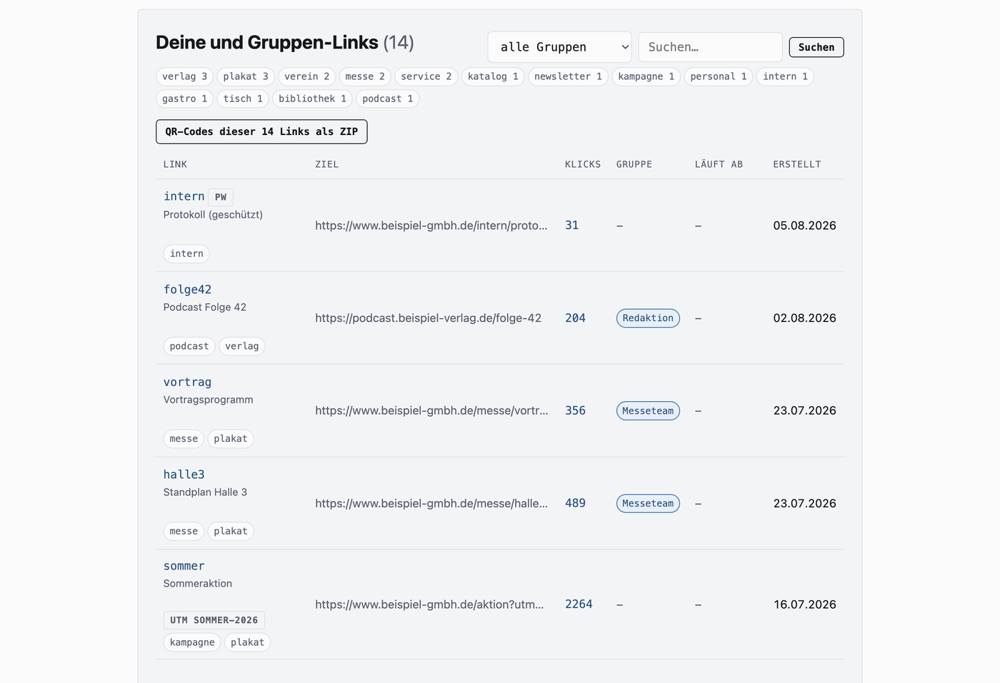
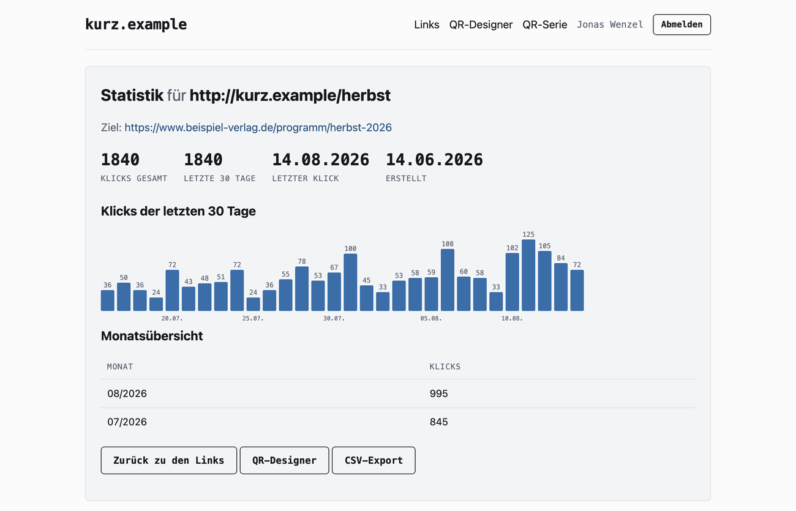
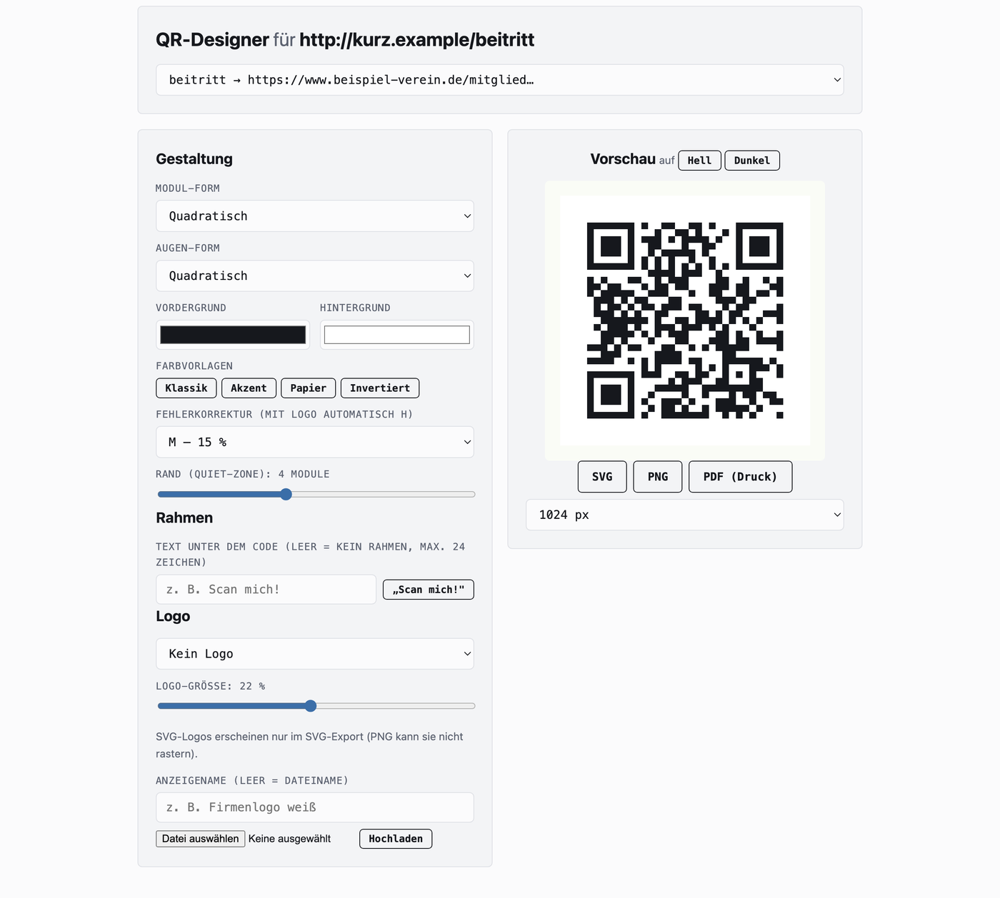
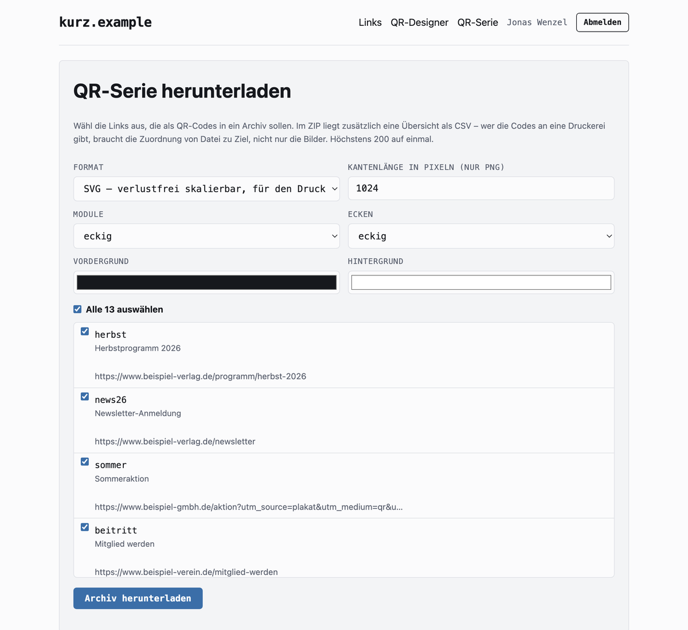
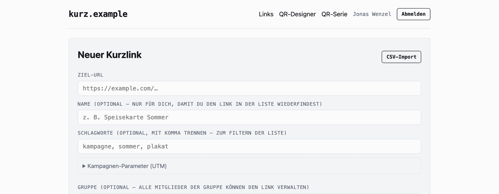
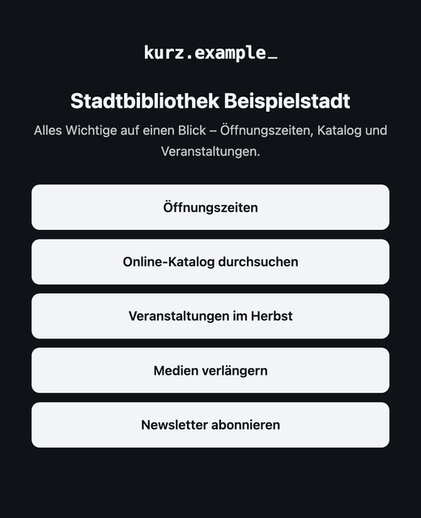

<h1 align="center">flatlink</h1>

<p align="center">
  <strong>Kurzlinks und QR-Codes, die ihre Besucher nicht vermessen.</strong><br>
  Reines PHP. Keine Datenbank, kein Composer, kein Build-Schritt –<br>
  Dateien auf einen Webspace kopieren, fertig.
</p>

<p align="center">
  <a href="LICENSE"></a>
  
  
  
</p>

<p align="center">
  
</p>

---

## Der Punkt

Praktisch jeder Kurzlink-Dienst protokolliert, **wer** klickt. flatlink
speichert je Link genau das hier – vollständig, nicht gekürzt:

```json
{ "n": 1840, "last": "2026-08-14", "days": { "2026-08-14": 72 } }
```

Ein Zähler pro Tag. Kein Datensatz für einzelne Aufrufe, also auch keine
IP-Adressen, keine Geräte- oder Browser-Kennungen, keine Referrer. Aus diesen
Daten lässt sich kein einzelner Besucher rekonstruieren, weil nie ein einzelner
Besucher gespeichert wird.

Auch der letzte Aufruf steht nur tagesgenau da. Bei einem Link mit einer
Handvoll Aufrufe wäre eine Uhrzeit sonst der einzige Wert im ganzen Bestand,
über den sich ein einzelner Besuch zeitlich verorten – und mit anderen Quellen
zusammenführen – ließe.

Das ist keine Absichtserklärung, sondern in [`inc/store.php`](inc/store.php) in
etwa zehn Zeilen nachlesbar (`clicks_bump()`). Prüf es nach – genau dafür liegt
der Code offen. Der Weiterleitungspfad (`go.php`) startet nicht einmal eine
Session, solange kein Passwortschutz auf dem Link liegt.

<p align="center">
  
</p>

## Wie es aussieht

<table>
<tr>
<td width="50%" valign="top">
<a href="docs/screenshots/qr-designer.png"></a>
<p><strong>QR-Designer.</strong> Modul- und Augenformen, freie Farben, Logo in
der Mitte, Rahmen mit Text. Export als SVG, PNG und druckfertiges PDF – aus
einem eigenen Encoder, ohne Fremdbibliothek.</p>
</td>
<td width="50%" valign="top">
<a href="docs/screenshots/qr-serie.png"></a>
<p><strong>QR-Serien.</strong> Zwanzig Tischaufsteller in einem Archiv, mit
Übersicht als CSV für die Druckerei. Das ZIP schreibt flatlink selbst – auch
ohne die PHP-Erweiterung <code>zip</code>.</p>
</td>
</tr>
<tr>
<td width="50%" valign="top">
<a href="docs/screenshots/neuer-link.png"></a>
<p><strong>Anlegen.</strong> Wunsch-Name, Name für die eigene Übersicht,
Schlagworte zum Filtern, Ablaufdatum, Passwortschutz und ein Baukasten für
Kampagnen-Parameter.</p>
</td>
<td width="50%" valign="top" align="center">
<a href="docs/screenshots/link-in-bio.png"></a>
<p align="left"><strong>Link-in-Bio.</strong> Eine Seite mit mehreren Zielen
unter einem Kurzcode. Gezählt wie alles andere: je Tag, für die Seite und je
Ziel, ohne Besucher-Datensatz.</p>
</td>
</tr>
</table>

## In fünf Minuten läuft es

```bash
git clone https://github.com/HerrBarmann/flatlink.git
cd flatlink
cp inc/config.example.php inc/config.php
php -S localhost:8080
```

Im Browser `http://localhost:8080/admin/` öffnen – der erste Aufruf legt das
Admin-Konto an. Für den Dauerbetrieb: Dateien auf den Webspace kopieren,
`data/` beschreibbar machen, `base_url` in der Konfiguration eintragen.
Ausführlich unter [Installation](#installation).

> **In English:** a self-hosted URL shortener and QR code generator written in
> dependency-free PHP. No database, no Composer, no build step – just copy the
> files onto any PHP 8.1 web space. Click statistics are a per-day counter and
> nothing else: no IP addresses, no user agents, no referrers, no per-visit
> records. Code comments and UI are in German. Licensed under the GNU AGPL
> v3 with an attribution term under section 7(b): every interface must keep a
> visible notice naming flatlink and linking to the project.

## Für wen das gedacht ist

- **Vereine, Praxen, Restaurants, kleine Betriebe**, die einen QR-Code drucken
  und das Ziel später ändern wollen, ohne den Aufkleber zu tauschen.
- **Bibliotheken, Schulen, Hochschulen, Verwaltungen**, die Kurzlinks nicht an
  einen Dienst außerhalb Europas geben dürfen. Anmeldung über LDAP oder
  Shibboleth, Gruppen mit eigenen Rechten und Limits, Namensräume je Abteilung.
- **Agenturen**, die mehrere Marken bedienen: eigene Domains je Kunde,
  gemeinsame Arbeitsgruppen, Schnittstelle für die Automatisierung.
- **Alle, die einen Satz belegen wollen statt ihn zu behaupten.** „Wir tracken
  nicht" ist auf einer Website eine Behauptung. Mit dem Quelltext daneben wird
  sie überprüfbar.

## Wo es im Einsatz ist

Der Autor betreibt mit flatlink den öffentlichen Dienst
[1337.kiwi](https://1337.kiwi) – dieselbe Software, nur mit eigenem Design und
den Inhalten, die ein öffentliches Angebot braucht. Was dort läuft, steht hier
im Quelltext; was hier für Organisationen dazukommt (zentrale Anmeldung,
Gruppen, Rechte), braucht der öffentliche Dienst nicht.

Wer flatlink installiert, bekommt **kein Imitat davon**: ein neutrales Theme,
das eigene Kürzel, die eigene Domain. Was bleibt, ist eine dezente
Herkunftszeile im Seitenfuß – die verlangt die [Lizenz](#lizenz), und sie ist
auch alles, was sie verlangt.

## Was drin ist

- **Kurzlinks** mit zufälligem oder selbst gewähltem Code, optionalem Namen,
  Schlagworten zum Filtern, optionalem Ablaufdatum und optionalem Passwortschutz
- **QR-Codes** aus einem eigenen Encoder (ISO/IEC 18004, Byte-Mode,
  **Versionen 1–40**, Fehlerkorrektur L/M/Q/H) – ohne jede Fremdbibliothek.
  Bis zu 2953 Zeichen, also auch lange Adressen mit Kampagnen-Parametern
- **QR-Designer** unter `qr-designer.php`: Modul- und Augenformen, freie
  Farben, **Farbverläufe**, **Druckfarben in CMYK**, Export als SVG, PNG,
  **Vektor-PDF und EPS**.
  Angemeldete bekommen auf derselben Seite zusätzlich eigenes Logo, Rahmen mit
  Text und die Auswahl ihrer Links – ein Kurzlink lässt sich dort auch gleich
  anlegen
- **Link-in-Bio-Seiten**: eine Seite mit mehreren Zielen unter einem Kurzcode,
  gezählt wie alles andere – je Tag, für die Seite und je Ziel, ohne
  Besucher-Datensatz
- **Statische QR-Codes** für eine **ungekürzte Adresse oder freien Text**,
  WLAN-Zugänge, Kontakte (vCard), Termine (iCalendar) und **GS1 Digital Link** – die Eingaben werden nirgends
  gespeichert, sondern direkt in den Code kodiert, sodass diese Grafiken völlig
  unabhängig vom Dienst funktionieren
- **Konten** mit Selbstregistrierung per Double-Opt-In, Passwort-Reset und
  Rollen (Nutzer/Admin), inklusive Nutzungs-Limits pro Konto
- **QR-Codes einzeln oder als Serie im ZIP**, mit Übersicht als CSV
- **Zwei-Faktor-Anmeldung**: Passkeys (WebAuthn) oder Einmalkennwörter aus
  einer App, mit Wiederherstellungscodes, optional für
  die ganze Instanz erzwingbar
- **Auskunft und Löschung im Profil**: Datenexport als JSON und ein Knopf, der
  Konto und Links wirklich entfernt – Art. 15, 17 und 20 DSGVO ohne
  Ticketsystem
- **Zentrale Anmeldung** über LDAP/Active Directory oder über den Webserver
  (Shibboleth, SAML, OpenID Connect) – siehe unten
- **Gruppen** in zwei Betriebsarten: als Rechtegruppe (Berechtigungen und
  Limits, Links bleiben privat) oder als Arbeitsgruppe, deren Links das ganze
  Team gemeinsam verwaltet
- **CSV-Import** für viele Links auf einmal – die Ausfuhren von Bitly und
  YOURLS lassen sich unverändert einlesen
- **Programmierschnittstelle** mit Zugangsschlüsseln je Konto, siehe
  [API.md](API.md)
- **Missbrauchsschutz**: Rate-Limits pro IP (gespeichert wird nur ein
  Schlüssel-Hash, kein Klartext), Meldeformular, Sperrfunktion, optional
  Google Safe Browsing
- **Automatisches Aufräumen** nie aufgerufener Links, mit Vorwarnung per Mail
  (standardmäßig deaktiviert)

## Voraussetzungen

- PHP 8.1 oder neuer
- Erweiterungen: `json`, `mbstring`, `gd` (für PNG/PDF), `fileinfo` (Logo-Upload),
  `openssl` (nur für SMTP-Versand), `ldap` (nur für die LDAP-Anmeldung)
- Ein Webserver mit `mod_rewrite` oder gleichwertiger Umschreibung.
  Die mitgelieferte `.htaccess` bringt zusätzlich einen Fallback über
  `ErrorDocument 404`, falls Rewrites beim Hoster nicht greifen.

Keine Datenbank, kein Composer, kein Build-Schritt.

## Installation

```bash
git clone https://github.com/HerrBarmann/flatlink.git
cd flatlink
cp inc/config.example.php inc/config.php
```

Danach `inc/config.php` anpassen (mindestens `site_name`), die Dateien in den
Webroot legen und sicherstellen, dass der Webserver in das Verzeichnis
schreiben darf – `data/` wird beim ersten Aufruf selbst angelegt.

Zum Ausprobieren reicht der eingebaute Server:

```bash
php -S localhost:8080
```

**Erstes Konto:** Über `register.php` registrieren. Im Standard steht der
Mailversand auf `log`, die Bestätigungsmail landet also in `data/mail.log` –
dort den Link herauskopieren und aufrufen. Das erste angelegte Konto bekommt
automatisch die Admin-Rolle.

> **Für den echten Betrieb** gibt es eine ausführliche
> **[Deployment-Anleitung](DEPLOYMENT.md)**: Rechte und Webserver-Konfiguration
> für Apache und nginx, Mailversand samt SPF/DKIM/DMARC, LDAP und Active
> Directory, die komplette Shibboleth-Einrichtung inklusive Apache und
> Attributfreigabe – dazu Betrieb, Sicherung und eine Tabelle mit den
> häufigsten Stolpersteinen.
>
> **Eigene Farben, eigenes Logo?** Das beschreibt die
> **[Anpassungs-Anleitung](CUSTOMIZATION.md)** – updatesicher über
> `assets/custom.css`, ohne den Quelltext anzufassen.

## Konfiguration

Alles steckt in `inc/config.php`; die kommentierte Vorlage ist
[`inc/config.example.php`](inc/config.example.php). Die wichtigsten Schalter:

| Option | Bedeutung |
| --- | --- |
| `site_name` | Anzeigename in Titel, Kopfzeile und Mails |
| `base_url` | Feste Basis-URL; leer = automatische Erkennung |
| `limits` | Links, Statistik-Tiefe und Logos pro Konto (`0` = unbegrenzt) |
| `default_perms` | Rechte, die jedes angemeldete Konto ohne Gruppe hat |
| `sso` | Zentrale Anmeldung über den Webserver (Shibboleth/SAML/OIDC) |
| `ldap` | Anmeldung gegen LDAP oder Active Directory |
| `qr_brand_text` | Optionale Absenderzeile unter erzeugten QR-Codes |
| `custom_code_min_len` / `custom_code_quota` | Bremsen gegen Namensraum-Squatting auf öffentlichen Instanzen |
| `mail` | `log` schreibt nach `data/mail.log`, `smtp` versendet echt |
| `safe_browsing_key` | Leer = aus. Siehe Warnung unten |
| `link_gc_years` | `0` = kein automatisches Aufräumen |
| `data_dir` | Laufzeitdaten außerhalb des Webroots ablegen – empfohlen |
| `trusted_proxies` | Adressen vorgelagerter Proxys; nötig für korrekte Rate-Limits |

Zur Laufzeit lassen sich im Admin-Bereich außerdem die öffentliche
Link-Erstellung und die Selbstregistrierung abschalten – praktisch, wenn die
Instanz nur intern genutzt werden soll.

## Gruppen und Rechte

Ohne Gruppen verhält sich flatlink wie ein Einzelplatz-Werkzeug: Jedes Konto
sieht nur seine eigenen Links. Gruppen ändern zwei Dinge.

**Geteilte Links.** Beim Anlegen eines Links lässt sich eine Gruppe wählen.
Der Link gehört dann dem ganzen Team: Jedes Mitglied sieht ihn, kann sein Ziel
ändern, den QR-Code gestalten, die Klickzahlen ansehen und ihn löschen. Das ist
der eigentliche Zweck – ein gedruckter Code soll nicht davon abhängen, ob die
Kollegin, die ihn angelegt hat, noch im Haus ist. Wer den Link ursprünglich
angelegt hat, behält ihn unabhängig von der Gruppe.

**Rechte.** Jede Gruppe trägt eine Menge von Rechten, die ihre Mitglieder
bekommen. Ein Konto in mehreren Gruppen hat die Summe aller Rechte. Verfügbar
sind:

| Recht | Bedeutung |
| --- | --- |
| `custom_code` | darf Wunsch-Namen vergeben statt Zufallscodes |
| `csv_import` | darf viele Links auf einmal importieren |
| `logo_upload` | darf eigene Logos für QR-Codes hochladen |
| `qr_unbranded` | erzeugt QR-Codes ohne die Absenderzeile |

### Namensräume

Eine Gruppe kann ein **Präfix** führen. Ihre Mitglieder legen Kurzlinks dann
ausschließlich darunter an:

```
kurz.hochschule.de/bib/oeffnungszeiten     ← Gruppe „Bibliothek", Präfix bib
kurz.hochschule.de/stud/mensaplan          ← Gruppe „Studierende", Präfix stud
```

Das löst den Streit um kurze Namen, bevor er entsteht: Jeder Bereich hat seinen
eigenen Raum, und `/mensaplan` bleibt frei für die zentrale Verwaltung. Wer in
mehreren Gruppen mit Präfix ist, wählt beim Anlegen; Administratoren sind nicht
beschränkt. Ohne Präfix verhält sich alles wie bisher.

### Limits und Befristung

Gruppen können außerdem **eigene Limits** mitbringen, die die globalen aus
`config.php` anheben – wer in mehreren ist, bekommt jeweils den höchsten Wert.
Und eine Mitgliedschaft lässt sich **befristen**: Nach dem Stichtag zählt sie
nicht mehr, ganz ohne Cronjob. Damit lässt sich ein gestaffeltes Angebot
abbilden, ohne dass die Software einen Tarifbegriff kennen müsste.

In `config.php` legt `default_perms` fest, was **jedes** angemeldete Konto
zusätzlich darf – auch ohne Gruppe. Administratoren dürfen immer alles.

Gerade Wunsch-Namen sind ein gutes Beispiel dafür, warum das an Gruppen hängt:
Der Namensraum einer Instanz ist endlich, und wer sich `/team` sichert, nimmt
ihn allen anderen weg. Als Gruppenrecht lässt sich das vergeben, statt es
entweder allen oder niemandem zu erlauben.

Angelegt werden Gruppen im Admin-Bereich unter **Gruppen**, zugeordnet werden
Konten unter **Nutzer**. Bei zentraler Anmeldung kann die Zuordnung auch aus
dem Verzeichnis kommen (siehe unten).

### Grundregeln und Gruppen

Was **jedes** Konto darf, steht unter *Einstellungen → Grundregeln*: Limits für
Links, Statistik-Tiefe und Logos, das Kontingent für Wunsch-Codes und die
Rechte, die alle bekommen. Die Vorgaben dafür stehen in `inc/config.php`; was
in der Oberfläche geändert wird, überschreibt sie und landet in
`data/settings.json`. Wer mehr bekommen soll als der Grundrahmen, bekommt es
über eine Gruppe.

### Zwei Arten von Gruppen

Eine Gruppe kann zweierlei bedeuten, und die beiden haben nichts miteinander zu
tun. Beim Anlegen wird es deshalb ausdrücklich gewählt:

| Art | Was sie tut | Wofür |
| --- | --- | --- |
| **Nur Rechte** | Vergibt Berechtigungen und Limits an ihre Mitglieder. Deren Links bleiben privat. | Tarife, Rollen, Kontingente |
| **Rechte und gemeinsame Linkverwaltung** | Zusätzlich lassen sich Links der Gruppe zuordnen; jedes Mitglied kann sie sehen, ändern und löschen. | Teams, die zusammenarbeiten |

Der Unterschied ist keine Feinheit. Hängt ein kostenpflichtiger Tarif an einer
Gruppe und ist diese als Arbeitsgruppe angelegt, taucht sie im Zuordnungsfeld
jedes Kunden auf – und wer sie versehentlich auswählt, gibt seinen Link für
sämtliche anderen Kunden zum Bearbeiten und Löschen frei.

Neue Gruppen legt die Oberfläche deshalb als **Rechtegruppe** an. Der
umgekehrte Irrtum ist billiger: Ein Team, das seine Links nicht sieht, meldet
sich sofort – ein Leck bemerkt niemand. Gruppen, die vor dieser Unterscheidung
angelegt wurden, gelten weiterhin als Arbeitsgruppen, damit bestehende Teams
nicht ausgesperrt werden; die Spalte *Art* in der Gruppenverwaltung zeigt für
jede Gruppe, woran man ist.

## Zwei-Faktor-Anmeldung

Warum das hier drin ist: Wer ein Konto übernimmt, kann das Ziel eines
Kurzlinks ändern – auch das eines Codes, der längst gedruckt auf einem Schild
klebt. Der Schaden trifft dann nicht den Kontoinhaber, sondern jeden, der
scannt. Für einen Dienst, der gedruckte Codes ausgibt, ist ein Passwort allein
eine dünne Tür.

Zwei Verfahren stehen zur Wahl, beide im Profil einzurichten. Sie schließen
sich nicht aus – wer beide hinterlegt, hat beim Anmelden die Wahl.

### Passkeys (WebAuthn)

Fingerabdruck, Gesicht oder Geräte-PIN, hinterlegt im Telefon, im Rechner oder
auf einem Sicherheitsschlüssel. Bis zu zehn Geräte je Konto.

Der Unterschied zum Einmalkennwort ist nicht die Bequemlichkeit, sondern die
**Bindung an die Domain**. Ein sechsstelliger Code lässt sich auf einer
nachgebauten Anmeldeseite eintippen und binnen Sekunden weiterreichen; einen
Passkey gibt der Browser dort gar nicht erst heraus, weil die Herkunft nicht
stimmt. Das ist der eigentliche Gewinn.

Umgesetzt in [`inc/webauthn.php`](inc/webauthn.php) – reines PHP, wie alles
hier: Der CBOR-Leser ist selbst geschrieben, die Unterschrift prüft das
OpenSSL, das PHP ohnehin mitbringt. Unterstützt werden ES256 (was Telefone und
Sicherheitsschlüssel praktisch immer liefern) und RS256 (ältere
Windows-Hello-Installationen). `assets/passkey.js` packt nur zwischen JSON und
der Binärschnittstelle des Browsers um; **geprüft wird ausschließlich auf dem
Server** – das Skript lässt sich ohne Sicherheitsverlust lesen, ändern und
umgehen.

Vier Prüfungen machen den Schutz aus, und keine davon darf wegfallen:

1. Die Aufgabe (*Challenge*) muss die sein, die der Server gestellt hat. Sie
   gilt fünf Minuten und genau einmal.
2. Die Herkunft (*Origin*) muss die eigene sein – hier hängt die
   Phishing-Abwehr.
3. Der Abdruck der Domain im Gerätedatensatz muss zur eigenen Domain passen.
4. Die Unterschrift muss zum hinterlegten Schlüssel passen.

Dazu der Signaturzähler: Läuft er zurück, wurde der Schlüssel vermutlich
kopiert, und die Anmeldung wird abgelehnt. Viele Geräte zählen gar nicht – nur
ein echter Rückschritt gilt als verdächtig.

Passkeys brauchen HTTPS (`localhost` ausgenommen). Auf einer Instanz ohne TLS
blendet das Profil den Knopf nicht ein, statt ein Versprechen zu geben, das der
Browser nicht einlöst.

**Es gibt keine Wiederherstellungscodes.** Ein Passkey lässt sich nicht
abschreiben und in den Safe legen. Deshalb zwei Wege zurück: ein zweites Gerät
hinterlegen – oder ein Administrator setzt die zweite Stufe unter *Nutzer*
zurück. Diese Möglichkeit ist Absicht und zugleich der schwächste Punkt der
Kette; wer sie benutzt, sollte sicher sein, mit wem er spricht.

### Einmalkennwörter aus einer App (TOTP)

QR-Code scannen, sechs Ziffern eintippen, fertig. Acht Wiederherstellungscodes
werden dabei einmal angezeigt; jeder gilt genau einmal, für den Fall, dass das
Telefon weg ist. Funktioniert auf jedem Gerät und in jedem Browser – aber es
lässt sich abtippen, und damit auch auf einer nachgebauten Seite eingeben.

Umgesetzt nach RFC 6238 in reinem PHP – HMAC-SHA1 und base32 bringt die
Sprache mit, den QR-Code erzeugt der eigene Encoder. Geprüft gegen die
Testvektoren des Standards.

Zwei Dinge, die nicht selbstverständlich sind:

- **Der QR-Code wird eingebettet, nicht verlinkt.** Die `otpauth`-Adresse
  enthält das Geheimnis; als URL landete es in Server-Protokollen, im Verlauf
  des Browsers und im Referrer. Das SVG entsteht im selben Aufruf.
- **Ein Kennwort gilt nur einmal.** Der zuletzt benutzte Zähler wird
  festgehalten. Ohne diese Sperre könnte jemand, der einmal über die Schulter
  geschaut hat, sich im selben halben Minutenfenster selbst anmelden.

### Erzwingen

Über `'totp_required'` (`off` | `admins` | `all`, auch unter *Einstellungen*)
lässt sich die zweite Stufe verlangen. **Erfüllt wird die Auflage durch eines
der beiden Verfahren** – der Schlüsselname ist aus der Zeit vor den Passkeys
und bleibt, damit bestehende Konfigurationen weiterlaufen. Wer noch keines
eingerichtet hat, wird nach der Anmeldung ins Profil geführt statt ausgesperrt;
das letzte verbliebene Verfahren lässt sich dann nicht mehr entfernen.

**API-Schlüssel sind davon nicht betroffen** – sie sind ein eigener Nachweis
und tragen kein Passwort, das ein Zweitfaktor absichern könnte. Wer ein Konto
besonders schützen will, prüft daher auch dessen Schlüsselliste.

## Zentrale Anmeldung

Beide Wege sind optional, stehen standardmäßig auf `false` und lassen sich
parallel zu lokalen Konten betreiben. Hier steht das Prinzip – die
Schritt-für-Schritt-Einrichtung samt Apache-Konfiguration, SP-Metadaten und
Attributfreigabe steht in der [Deployment-Anleitung](DEPLOYMENT.md#8-shibboleth-saml-und-openid-connect).

### Über den Webserver (Shibboleth, SAML, OpenID Connect)

Der empfohlene Weg für einen Shibboleth-IdP. Die eigentliche Anmeldung erledigt
ein Servermodul – `mod_shib`, `mod_auth_mellon` oder `mod_auth_openidc` –, das
den Admin-Bereich schützt. flatlink liest nur, wen der Server bereits
authentifiziert hat. Für Apache:

```apache
<Location /admin>
    AuthType shibboleth
    ShibRequestSetting requireSession 1
    Require valid-user
</Location>
```

Dann in `config.php` unter `sso` die Variable benennen, in der die Kennung
steht (meist `REMOTE_USER`), optional die für E-Mail-Adresse und
Gruppenzugehörigkeit, und `login_url` auf `/Shibboleth.sso/Login` setzen.
Konten entstehen beim ersten Login automatisch.

> **Sicherheitshinweis, bitte nicht überlesen.** Variablen, die der Webserver
> selbst setzt (`REMOTE_USER`, die Attribute von `mod_shib`), sind
> vertrauenswürdig. Ein Wert, der als **HTTP-Header** ankommt – der
> Variablenname beginnt dann mit `HTTP_` –, ist es nicht: Den kann jeder
> Client frei erfinden und sich damit als beliebiger Nutzer ausgeben, inklusive
> Administrator. flatlink akzeptiert solche Variablen deshalb nur, wenn unter
> `trusted_proxies` die IP-Adresse des Reverse Proxy steht, der diese Header
> nachweislich überschreibt. Ohne diesen Eintrag werden sie verworfen und die
> Anmeldung schlägt fehl. Das ist Absicht.

### Über LDAP oder Active Directory

Hier fragt flatlink selbst beim Verzeichnis nach; Kennung und Passwort werden
im gewohnten Login-Formular eingegeben. Braucht die PHP-Erweiterung `ldap`.

Geprüft wird per Bind als der gefundene Nutzer – das Passwort wird nirgends
gespeichert und nicht mit einem lokalen Hash verglichen. Eingaben werden vor
dem Einsetzen in den Suchfilter escaped, LDAP-Injection ist damit nicht
möglich; leere Passwörter werden abgelehnt, bevor sie als „unauthenticated
bind" fälschlich als Erfolg durchgehen könnten.

Reihenfolge beim Login: erst das lokale Passwort, dann das Verzeichnis. Lokale
Konten funktionieren also weiter – wichtig, damit man sich nicht aussperrt,
wenn der LDAP-Server einmal nicht erreichbar ist.

Bei `ldap://` unbedingt `start_tls` einschalten, sonst geht das Passwort im
Klartext über das Netz. Besser gleich `ldaps://`.

### Gruppen aus dem Verzeichnis

Beide Wege können Gruppenzugehörigkeiten übernehmen: bei SSO aus einem
Attribut wie `isMemberOf` oder `entitlement`, bei LDAP aus `memberOf` oder per
Suche im Gruppenbaum. Die Zuordnungstabelle `group_map` bildet externe Namen
auf lokale Gruppen ab:

```php
'group_map' => [
    'urn:mace:example.org:group:marketing' => 'marketing',
    'cn=it,ou=groups,dc=example,dc=org'    => ['it', 'technik'],
],
```

Ist die Tabelle leer, wird ein externer Name nur übernommen, wenn es lokal
eine gleichnamige Gruppe gibt. Aus dem Verzeichnis kommende Namen können nie
neue Gruppen anlegen und nie Rechte erfinden – welche Rechte an einer Gruppe
hängen, entscheidet immer die lokale Konfiguration.

### Anzeigenamen

Kommt die Kennung als undurchsichtige Zeichenkette aus der Föderation
(`persistent-id`, `pairwise-id`), ist die Nutzerverwaltung ohne Klarnamen
kaum bedienbar. Deshalb übernimmt flatlink auf Wunsch einen Anzeigenamen aus
dem Verzeichnis – bei SSO über `name_var`, bei LDAP über `name_attr`. In der
Oberfläche steht dann der Name, die technische Kennung nur klein darunter.
Lokale Konten setzen ihren Anzeigenamen selbst im Profil, Administratoren
können ihn überall nachpflegen. Gesucht wird über Name, Kennung und
E-Mail-Adresse gleichzeitig.

Die Rolle bleibt beim erneuten Login unangetastet: Wer hier zum Administrator
gemacht wurde, bleibt es. Und ein Konto, das zentral verwaltet wird, kann sich
nicht mehr über das lokale Passwortformular anmelden – sonst wäre die zentrale
Anmeldung über ein altes Passwort umgehbar.

### Was zentral verwaltete Konten im Profil können

Wer sich über LDAP oder den Webserver anmeldet, hat hier keinen Passwort-Hash –
die Anmeldung weist solche Konten lokal ab, und jede Anmeldung über das
Verzeichnis entfernt einen etwaigen Alt-Hash. Das Profil zeigt darum kein
Passwortformular, sondern den Hinweis, wo das Passwort hingehört. Ebenso beim
Anzeigenamen: Liefert das Verzeichnis einen, gewinnt er. Eine E-Mail-Adresse
lässt sich dagegen eintragen – sie wird nur überschrieben, wenn das Verzeichnis
selbst eine mitliefert.

### Auskunft, Mitnahme, Löschung

Im Profil steht beides ohne Umweg über den Betreiber:

**Daten herunterladen** liefert eine JSON-Datei mit allem, was zum Konto
gespeichert ist – Kontodaten, Gruppen, Rechte, Limits und jeder Kurzlink mit
Ziel, Datum und Klickzahlen. Der Passwort-Hash ist bewusst nicht dabei: Er ist
ein Zugangsmittel und kein Inhalt, und eine Datei damit landet danach im
Download-Ordner. Das deckt Art. 15 (Auskunft) und Art. 20 (Mitnahme).

**Konto löschen** entfernt das Konto und alle Links, die nur daran hängen,
samt Klickzählern. Links **mit Gruppenzuordnung bleiben** und verlieren nur
ihren Besitzer – sie gehören der Gruppe, andere arbeiten damit weiter, und
gedruckte QR-Codes darauf sollen nicht ins Leere zeigen, weil eine Person
geht. Vorher wird das Passwort abgefragt (bei zentraler Anmeldung: die eigene
Kennung abgetippt), der letzte Administrator kann sich nicht selbst entfernen.

Auf einer Instanz mit zentral verwalteten Konten ist der Löschknopf
irreführend, weil das Verzeichnis das Konto bei der nächsten Anmeldung neu
anlegt. Dort `'self_delete' => false` setzen – der Export bleibt davon
unberührt.

### Zwei Hinweise zum Datenschutz

**Google Safe Browsing** ist standardmäßig **aus**. Wer es aktiviert, schickt
beim Anlegen eines Links dessen Ziel-URL an Google. Für eine öffentliche
Instanz ist das ein wirksamer Schutz gegen Phishing-Missbrauch, für eine interne
meist überflüssig. Wer es einschaltet, sollte es in seiner
Datenschutzerklärung angeben.

**Der Webserver protokolliert weiter.** flatlink speichert keine IP-Adressen,
die Zugriffs-Logs von Apache oder nginx tun es in aller Regel schon. Wer den
Anspruch ernst nimmt, kürzt oder deaktiviert sie dort.

## Link-in-Bio

Eine Seite mit mehreren Zielen unter einem Kurzcode – für das Profil im
sozialen Netz, den Aufkleber am Schaufenster, die Fußzeile einer Speisekarte.
Anzulegen unter *Link-in-Bio* im Verwaltungsbereich, sofern das Konto das Recht
`bio_page` hat.

Technisch ist eine solche Seite **ein Eintrag im Kurzlink-Bestand**, der statt
einer Zieladresse eine Liste davon trägt (`kind: "bio"`). Dadurch erbt sie
Code-Vergabe, Besitz, Gruppenzugehörigkeit, Zugriffsprüfung, Ablaufdatum,
Sperre, Löschung und QR-Code – es gibt keine zweite Ablage und kein zweites
Rechtemodell. Gehört sie einer Arbeitsgruppe, pflegen sie alle Mitglieder.

Die Ziele werden als Feldpaare gepflegt – Anzeigename und Adresse, weitere über
*Link hinzufügen*. Ohne JavaScript stehen immer drei leere Zeilen bereit, sodass
sich die Seite auch dann bedienen lässt.

Gezählt wird wie überall: ein Zähler je Tag für die Seite und einer je Ziel.
Damit Letzteres möglich ist, zeigen die Schaltflächen auf den eigenen Code mit
einer laufenden Nummer (`/abc123?i=2`) statt unmittelbar auf die Zieladresse.
Ein Besucher-Datensatz entsteht dabei nicht — die Nummer sagt nur, *welches*
Ziel geklickt wurde, nicht *von wem*.

Die Seite wird **als eigenes Dokument ausgeliefert**, nicht im Theme der
Instanz: keine Kopfnavigation, kein Hinweis auf Anmeldung oder Tarife, und ab
Werk auch keine Absenderzeile im Fuß. Sie gehört dem, der sie angelegt hat –
wer den QR-Code am Schaufenster scannt, will die Speisekarte und nicht das
Menü des Kurzlink-Dienstes.

Wer eine öffentliche Instanz mit kostenlosen Konten betreibt, hat gute Gründe
für eine Herkunftszeile und setzt sie über `bio_footer_text` (Vorspann) und
`bio_footer_glyph` (Bildzeichen); `''` lässt nur die Wortmarke stehen, `null`
– die Vorgabe – die ganze Zeile weg.

Die Reihenfolge der Ziele lässt sich mit Pfeiltasten je Zeile ändern – ohne
JavaScript bleibt sie die Reihenfolge der Felder, was ebenfalls funktioniert,
nur mühsamer. Wie eine Seite ohne eigene Gestaltung aussieht, bestimmt
`bio_default_colors`; steht dort nichts, bleibt ein neutrales Dunkelgrau. Wo
kein eigenes Logo hinterlegt ist, steht am Kopf die Wortmarke der Instanz,
aufgebaut wie in deren Seitenkopf.

Konten mit dem Recht `bio_style` wählen zusätzlich **ein Logo aus der
Logo-Bibliothek und vier Farben** (Hintergrund, Schrift, Schaltflächen und
deren Beschriftung). Die Farbwerte werden gegen `#rrggbb` geprüft, bevor sie in
den Stilblock gelangen; alles andere fällt auf die Vorgabe zurück. Das Logo
liefert `logo.php` aus – ein Endpunkt, der genau eine Datei herausgibt und nur
dann, wenn ihre Kennung in der Bibliothek verzeichnet ist. Wie viele Seiten ein
Konto anlegen darf, steht als Limit `bio` in den Grundregeln und lässt sich je
Gruppe erhöhen.

Suchmaschinen sind standardmäßig ausgeschlossen (`noindex`); wer die Seite
gefunden haben möchte, hakt das ausdrücklich an. Eine Seite, die als QR-Code an
einer Tür klebt, muss nicht auch im Index stehen.

## GS1 Digital Link

`qr.php` erzeugt neben Kurzlink-, WLAN-, vCard- und Termin-Codes auch
**GS1 Digital Links** – die Adressform, die ab „Sunrise 2027" auf Verpackungen
neben oder statt des Strichcodes stehen soll:

```
POST qr.php
  t=gs1
  gtin=4006381333931       Artikelnummer, 8/12/13/14 Ziffern
  lot=LOT-42               Charge (optional)
  serial=SN-0001           Seriennummer (optional)
  mhd=2027-12-31           Haltbarkeitsdatum (optional)
  resolver=https://…       eigener Auflösungsdienst (optional)
```

Daraus wird `https://id.gs1.org/01/04006381333931/10/LOT-42?17=271231`. Die
Reihenfolge der Bestandteile ist in der GS1-Syntax festgelegt und keine
Geschmackssache; Lesegeräte verlassen sich darauf. Die **Prüfziffer der GTIN
wird nachgerechnet** – stimmt sie nicht, kommt eine Fehlermeldung statt eines
Codes, der auf einer Palette auffällt.

Was flatlink **nicht** tut: einen Resolver betreiben. Was beim Scannen
erscheint, entscheidet der Betreiber der eingetragenen Adresse; ohne Angabe
zeigt der Code auf den Dienst von GS1 selbst. Die Logik steht in
[`inc/gs1.php`](inc/gs1.php), eine Bedienoberfläche dafür bringt flatlink nicht
mit – sie ist als eigene Seite schnell gebaut.

## Export für den Druck

Fünf Formate aus derselben Vorlage:

| Format | Wofür |
| --- | --- |
| SVG | Web und Weiterverarbeitung, mit eingebettetem Logo |
| PNG | Bildschirm, Office, alles Pixelige |
| **PDF** | echte Vektoren, eine Seite in der gewünschten Größe |
| **EPS** | Satz und Belichtung – das Format, nach dem Druckereien fragen |

PDF und EPS enthalten **keine Pixelgrafik**: Der Code besteht aus Pfaden und
lässt sich auf Plakatgröße ziehen, ohne weich zu werden. Das PDF eines
gewöhnlichen Codes ist dabei rund 4 kB groß – ein Bruchteil der eingebetteten
Grafik, die vorher darin steckte.

**CMYK.** Wer die vier Druckfarben angibt, bekommt sie *unverändert* in PDF und
EPS. Umgerechnet wird nur in die andere Richtung: SVG, PNG und die Vorschau
zeigen eine Näherung, weil ein Bildschirm kein CMYK kann. Ohne Farbprofil gibt
es dafür keine richtige Antwort – verbindlich ist die Druckdatei, und die
Oberfläche sagt das auch.

Beide Formate holen ihre Geometrie aus derselben Quelle wie das SVG
([`QrRenderer::vectorOps()`](inc/qrlib.php)); der Text nutzt Courier aus dem
Standardvorrat beider Formate, also ohne eingebettete Schriftdatei und ohne
Lizenzfrage.

Nachgewiesen wird das ohne Ghostscript: Ein Prüfprogramm liest die erzeugten
Dateien zurück, zeichnet die enthaltenen Pfade und lässt `zbarimg` sie scannen –
über alle Modul- und Augenformen, mit Rahmen, mit Absenderzeile und in CMYK.

## Augen

Der äußere Ring und der innere Kern lassen sich getrennt formen (quadratisch,
abgerundet, rund, Blatt) und getrennt einfärben. Leer heißt jeweils „wie das
darüber": Der Kern nimmt Form und Farbe des Rings, der Ring die Farbe der
Datenmodule – die Vorgabe bleibt damit genau das, was sie vorher war.

**Der runde Ring ist bewusst kein voller Kreis**, sondern ein sehr stark
abgerundetes Quadrat (Radius 3,0 statt 3,5 Module). Gemessen über 1224
Kombinationen aus Modulform, Augenform, Inhalt und Rastergröße: Mit vollem
Kreis lasen sich 90 % der erzeugten Bilder, mit 3,0 sind es 100 %. Der Grund
steht in der Norm – ein Scanner sucht Linien, auf denen das Suchmuster im
Verhältnis 1:1:3:1:1 liegt; beim Quadrat stimmt das auf jeder der sieben
Zeilen, beim vollen Kreis nur nahe der Mitte. Am Aussehen ändern die 0,5
Module wenig, an der Verlässlichkeit alles.

**Zur Blattform eine Anmerkung, die den Umgang mit Gestaltung hier zeigt.**
Sie hatte zunächst einen Radius von 3,5 Modulen, also eine halb weggeschnittene
Ecke – hübsch, aber der Code fiel bei mehreren Rastergrößen durch, während die
übrigen Formen bei denselben Größen sauber lasen. Das Suchmuster muss entlang
jeder Abtastlinie durch seine Mitte das Verhältnis 1:1:3:1:1 halten; wer die
Hälfte davon wegschneidet, verlässt den Bereich, in dem sich ein Scanner
auskennt. Der Radius ist deshalb auf 2,0 zurückgenommen. Gestaltung darf einen
Code nicht unlesbar machen.

## Farbverläufe

Linear mit frei wählbarer Richtung oder radial von innen nach außen, dazu vier
Vorlagen. Der Verlauf liegt über den Datenmodulen und den Augen; der
Hintergrund bleibt einfarbig.

**Gefärbt wird modulweise, nicht mit dem Verlaufs-Werkzeug des jeweiligen
Formats.** SVG und PDF könnten einen glatten Verlauf, PNG und EPS in Level 2
nicht – vier Formate mit zwei Verfahren wären vier Ergebnisse, die sich im
Detail unterscheiden. Ausgerechnet beim Druckexport will niemand herausfinden,
warum die Datei anders aussieht als die Vorschau. Ein QR-Code besteht ohnehin
aus Kacheln; eine Farbe je Kachel ist bei jeder vernünftigen Größe von einem
glatten Verlauf nicht zu unterscheiden.

**Mit CMYK verträgt sich das nicht**, und deshalb gewinnt dort die Druckfarbe:
Ein Verlauf im Vierfarbdruck ist eine Entscheidung für sich – Rasterung,
Farbauftrag, Papier –, und ein stillschweigend umgerechneter Verlauf wäre keine
gute Antwort darauf. Die Oberfläche sagt das, statt es geschehen zu lassen.

## Zwei Arten von QR-Code

Der Designer bietet beide Wege, und der Unterschied ist die eine Entscheidung,
die vor dem Drucken zu treffen ist:

**Mit Kurzlink.** Der Code zeigt auf die eigene Instanz. Das Ziel lässt sich
jederzeit ändern, ohne den gedruckten Code auszutauschen, und es gibt eine
Klickzahl. Der Code braucht die Instanz, solange er im Umlauf ist.

**Ohne Kürzen** (`qr-designer.php?m=statisch`). Die Adresse steht unmittelbar
im Code. Gespeichert wird nichts, der Code läuft über niemanden und
funktioniert auch dann noch, wenn es die Instanz nicht mehr gibt. Dafür steht
das Ziel fest.

Der statische Weg nimmt auch `mailto:`, `tel:` oder schlicht einen Text. Fehlt
bei etwas Domain-Förmigem das Schema, wird `https://` ergänzt – sonst bleibt
die Eingabe unangetastet.

## Der Encoder

Reines PHP nach ISO/IEC 18004, Byte-Mode, Versionen 1–40, alle vier
Fehlerkorrektur-Stufen, Maskenwahl über den Penalty-Score der Norm.

Aus der Norm abgetippt sind nur **zwei Zahlenreihen je Stufe** – ECC-Codewörter
je Block und Anzahl Blöcke aus Tabelle 9. Alles andere ergibt sich daraus
rechnerisch: die Gesamtzahl der Codewörter aus der Geometrie der Matrix, die
Aufteilung in kurze und lange Blöcke aus einer Division mit Rest, die Lage der
Ausrichtungsmuster aus der Schrittweiten-Regel. Eine Tabelle mit 320
handgetippten Werten wäre die wahrscheinlichere Fehlerquelle gewesen.

Geprüft wird das nicht durch Hinsehen: Alle **160 Kombinationen** aus Version
und Fehlerkorrektur werden randvoll gefüllt, gerendert und mit einem fremden
Decoder (`zbarimg`) byteweise zurückgelesen. Die Höchstlängen, die dabei
herauskommen – 2953 / 2331 / 1663 / 1273 Byte für L/M/Q/H – sind genau die der
Norm.

## QR-Serien als ZIP

Zwanzig Tischaufsteller, eine Ausstellung, eine Aufkleberserie: *QR-Serie* in
der Kopfzeile packt die QR-Codes mehrerer Links in ein Archiv. Format (SVG oder
PNG), Modul- und Eckenform, Farben und Größe gelten für die ganze Serie.

Der Weg führt über die Liste: nach Schlagwort oder Gruppe filtern, dann den
Knopf über der Tabelle – die Auswahl steht schon. Höchstens 200 Codes je
Archiv.

Im ZIP liegt **eine Übersicht als CSV**. Wer eine Serie an eine Druckerei gibt,
braucht die Zuordnung von Datei zu Ziel, nicht nur die Bilder; und die
Dateinamen tragen zusätzlich den Namen des Links, damit sie auf einem fremden
Schreibtisch noch etwas bedeuten.

Geschrieben wird das Archiv von [`inc/zip.php`](inc/zip.php) – **ohne die
PHP-Erweiterung `zip`**. Sie ist nicht überall eingeschaltet und will eine
echte Datei auf der Platte: erst schreiben, dann ausliefern, dann aufräumen.
Genau der Fall, der auf günstigem Hosting scheitert und beim Entwickler nie.
Das Format selbst ist überschaubar, wenn man weglässt, was hier ohnehin
niemand braucht: keine Verschlüsselung, keine geteilten Archive, kein ZIP64.
Verdichtet wird mit `gzdeflate()`, wo es etwas bringt – sonst wird gespeichert;
beides ist im Format vorgesehen.

## Kampagnen-Parameter (UTM)

Beim Anlegen und Ändern eines Links lassen sich `utm_source`, `utm_medium`,
`utm_campaign`, `utm_term` und `utm_content` eintragen. Sie werden an die
Ziel-Adresse gehängt; vorhandene Query-Parameter bleiben unangetastet, ein
Anker bleibt hinten.

**Ausgewertet wird das nicht hier.** Diese Parameter sind die einzige
Möglichkeit, der Statistik der *Zielseite* – Matomo, Plausible, Google
Analytics – mitzuteilen, woher jemand kam. Der Kurzlink selbst zählt weiterhin
nur Aufrufe je Tag: keine Herkunft, kein Gerät, kein Datensatz je Besuch. Wer
UTM-Parameter setzt, gibt die Herkunft absichtlich an die Zielseite weiter. Ein
Werkzeug, keine Empfehlung – deshalb ist der Block zugeklappt und leer, bis
jemand ihn benutzt.

**Keine eigene Datenhaltung.** Die Parameter stehen in der Ziel-URL und sonst
nirgends. Der Baukasten liest sie von dort und schreibt sie dorthin zurück –
sie zusätzlich am Link zu speichern hieße, zwei Wahrheiten zu pflegen. Wer die
Adresse von Hand ändert, ändert damit auch die Kampagne, und das Formular zeigt
beim nächsten Öffnen den neuen Stand.

Schon benutzte Werte erscheinen als Vorschlagsliste. Das ist der billigste
Schutz gegen den Tippfehler, der eine Auswertung in zwei Hälften zerlegt.

Verfügbar auch im CSV-Import (für den ganzen Vorgang, nicht je Zeile) und über
die [Schnittstelle](API.md) (Feld `utm`).

## Mehrere Domains

Kurzlinks lassen sich unter mehreren Adressen ausgeben – `kunde.link/shop`
statt `deine-instanz.de/shop`. Alle Domains zeigen auf dieselbe Installation:
im DNS auf denselben Server, im Zertifikat mit aufgeführt. Eingerichtet werden
sie unter *Einstellungen* oder über `'domains'` in der Konfiguration; eine
Domain lässt sich einer Gruppe vorbehalten, so wie ein Namensraum-Präfix.

**Ein Code gehört der Instanz, nicht der Domain.** Es gibt `/shop` genau
einmal, und er löst unter jeder eingerichteten Adresse auf. Das ist die
tragende Entscheidung, deshalb beide Seiten:

- *Dafür:* Ein gedruckter Code stirbt nicht, wenn eine Domain wegfällt. Zieht
  ein Kunde um oder läuft eine Domain aus, funktionieren die Aufkleber weiter.
  Für einen Dienst, dessen ganzer Zweck „gedruckt ist gedruckt" lautet, wiegt
  das schwerer als Exklusivität.
- *Dagegen:* Zwei Kunden können nicht beide `/shop` haben. Wer das braucht,
  gibt ihnen [Namensraum-Präfixe](#zwei-arten-von-gruppen) – dafür sind sie da.

Getrennte Namensräume je Domain wären eine andere Datenhaltung: Ein Link wäre
nicht mehr durch seinen Code bestimmt, sondern durch Domain *und* Code. Das
zöge sich durch Ablage, Schnittstelle, Import und jede Oberfläche.

Die **Verwaltung bleibt auf der Hauptdomain** – der aus `base_url`. Eine
Sitzung, ein Cookie, eine Adresse für Passkeys: Ein unter `kunde.link`
eingerichteter Passkey ließe sich auf der Hauptdomain nicht mehr benutzen.
Aufrufe von `/admin/` unter einer Nebendomain werden deshalb umgeleitet, bevor
überhaupt eine Sitzung entsteht.

Eine Nebendomain liefert **nur Kurzlinks** aus. Startseite, QR-Generatoren,
Meldeseite und Verwaltung leiten auf die Hauptdomain um (302, nicht 301 – eine
Domain kann später zur Hauptdomain werden). Ausgenommen sind die Seiten, die zu
einem Code gehören: Passwortabfrage, abgelaufen, gesperrt, nicht gefunden. Sie
bleiben unter der Adresse, unter der der Code gedruckt wurde.

Wählbar ist die Domain beim Anlegen, beim Ändern, im CSV-Import (für den
ganzen Vorgang, nicht je Zeile) und über die [Schnittstelle](API.md)
(Feld `domain`). Wird eine Domain wieder entfernt, bleiben die Links bestehen –
sie zeigen dann auf eine Adresse, die nicht mehr eingerichtet ist, und müssen
einzeln umgestellt werden. Der Löschen-Knopf sagt das.

## Schlagworte

Ab ein paar hundert Links reicht die Suche nicht mehr. Jeder Link nimmt bis zu
acht Schlagworte auf, mit Komma getrennt eingegeben. Über der Liste steht eine
Wolke aller vergebenen Schlagworte mit ihrer Häufigkeit; ein Klick filtert, ein
zweiter auf „alle anzeigen" hebt den Filter wieder auf. Filter und Suche lassen
sich verbinden.

Schlagworte werden **kleingeschrieben abgelegt**: „Kampagne" und „kampagne"
sollen dieselbe Schublade sein, sonst hat man nach einer Woche beide. Sie sind
Ordnung, keine Berechtigung – wer Zugriff regeln will, nimmt
[Gruppen](#zwei-arten-von-gruppen).

Verfügbar auch über die [Schnittstelle](API.md) (Feld `tags`, Filter `?tag=`)
und im CSV-Import (Spalte `schlagworte` oder `tags`).

## Umzug von einem anderen Dienst

Der CSV-Import unter *Links → CSV-Import* erkennt die Spalten an der Kopfzeile
statt an ihrer Reihenfolge. Die Ausfuhr von **Bitly** (`Bitlink`, `Long URL`,
`Title`) und die von **YOURLS** (`keyword`, `url`, `title`) lassen sich damit
unverändert hochladen. Steht in der Code-Spalte eine vollständige Adresse wie
`bit.ly/3xYz9`, wird der letzte Teil übernommen – die Kurzcodes bleiben also
erhalten, und gedruckte Codes zeigen nach dem Umschalten der Domain weiter
dorthin, wo sie sollen.

Erkannt werden unter anderem `long url` / `url` / `ziel` für das Ziel,
`keyword` / `bitlink` / `slug` / `code` für den Kurzcode, `title` / `name` für
den Namen und `expires` / `ablaufdatum` für das Ablaufdatum. Fehlt eine
Kopfzeile, gilt die feste Reihenfolge `url;code;ablaufdatum;name`.

Der Import steht **jedem Konto** offen, damit ein Umzug nicht an einer
Berechtigung scheitert: Ohne das Recht `csv_import` reicht ein Durchgang so
weit, wie noch Platz im eigenen Link-Kontingent ist – das greift beim Anlegen
ohnehin. Erst der Massenbetrieb darüber hinaus hängt am Recht.

Wie viele Zeilen ein Durchgang dann annimmt, steht in `'import_max_rows'`
(Vorgabe 100). Wer einen größeren Bestand übernimmt, erhöht den Wert und lässt
den Import in Ruhe laufen – jede Zeile schreibt in ihre eigene Ablage.

## Wie die Daten liegen

Alles unter `data/`, als JSON, mit `flock` gegen gleichzeitige Schreibzugriffe
und atomarem Schreiben über Tempdatei plus `rename`:

| Datei | Inhalt |
| --- | --- |
| `links/<xx>.json` | Kurzlinks, auf 256 Ablagen verteilt: Ziel, Besitzer, Gruppe, Typ, Ablauf, Passwort-Hash |
| `users.json` | Konten: Passwort-Hash, Rolle, E-Mail, Gruppen, Anmeldequelle |
| `groups.json` | Gruppen: Anzeigename und Rechte |
| `clicks/<code>.json` | Klickzähler, siehe oben |
| `settings.json` | Zur Laufzeit änderbare Einstellungen |
| `logos/` | Hochgeladene Logos für QR-Codes |
| `ratelimit/` | Zähler je IP-Hash (HMAC mit Instanz-Geheimnis), nach 24 h gelöscht |
| `secret.key` | Geheimnis dieser Instanz für die IP-Hashes – wie ein Passwort behandeln |
| `pending/` | Offene Bestätigungs-Token (Registrierung, Reset) |

Ein Backup ist damit ein simples Kopieren des `data/`-Ordners.

Die Kurzlinks liegen dabei nicht in einer einzigen Datei, sondern auf 256
Ablagen verteilt (zugeordnet über den Code-Hash). Der Grund ist der
Weiterleitungspfad: Er läuft bei jedem Scan eines gedruckten Codes und liest
so nur wenige Kilobyte statt der gesamten Sammlung. Gemessen bei 100.000
Links: **0,4 statt 51 Millisekunden** pro Weiterleitung. Nebeneffekt:
Schreibvorgänge sperren nur ihre eigene Ablage.

Diese Bauweise ist bewusst für kleine bis mittlere Instanzen gedacht. Bei
sehr vielen gleichzeitigen Schreibzugriffen ist eine Datenbank die bessere
Wahl – dafür braucht flatlink weder Einrichtung noch Wartung noch Migration.

## Was nicht drin ist

Damit niemand danach sucht: keine
mehrsprachige Oberfläche (die Texte sind deutsch), keine Statistik nach Ländern
oder Geräten – Letzteres liegt in der Natur der Sache. Gruppen teilen Links und
Rechte, trennen aber keine Mandanten voneinander: Administratoren sehen immer
alles.

Ebenfalls nicht enthalten sind **Impressum, Datenschutzerklärung und AGB**.
Wer eine öffentliche Instanz betreibt, ist in Deutschland und weiten Teilen
der EU dazu verpflichtet, solche Angaben selbst bereitzustellen – sie hängen
von Betreiber, Land und Nutzung ab und lassen sich nicht sinnvoll mitliefern.
Eigene Seiten anlegen und in `page_footer()` in
[`inc/helpers.php`](inc/helpers.php) verlinken.

## Beschriftung im PNG

Rahmen- und Absendertexte werden im SVG sauber gesetzt. Für PNG und PDF braucht
GD eine TrueType-Datei: eine beliebige `.ttf` nach `assets/fonts/` legen, die
erste gefundene wird genommen. Ohne Datei greift ein grober GD-Systemfont.
Es ist bewusst keine Schrift mitgeliefert, damit dem Projekt keine fremde
Font-Lizenz anhängt.

## Mitmachen

Fehlerberichte und Pull Requests sind willkommen. Eine Bitte vorab: Die
Abhängigkeitsfreiheit ist kein Zufall, sondern der Kern des Projekts. Ein
Patch, der Composer, einen Build-Schritt oder eine Datenbank einführt, wird
nicht übernommen – auch wenn er die Sache eleganter macht.

## Lizenz

**[GNU AGPL v3](LICENSE)** mit einer Zusatzbedingung zur Namensnennung nach
§ 7(b) der Lizenz. Was das praktisch heißt:

**Erlaubt, ohne zu fragen** – auch kommerziell, auch für zahlende Kundschaft:
benutzen, selbst betreiben, ändern, weitergeben, umbenennen, einfärben, für
eigene Zwecke erweitern.

**Zwei Bedingungen:**

1. **Die Herkunftszeile bleibt sichtbar.** Jede Oberfläche muss auf „flatlink"
   hinweisen und auf <https://1337.kiwi/flatlink> verlinken. Übersetzen,
   umformulieren, klein und dezent setzen – alles erlaubt. Verstecken oder
   weglassen nicht. Der Bezugspunkt ist `origin_note()` in
   [`inc/helpers.php`](inc/helpers.php).
2. **Änderungen bleiben offen.** Wer eine *geänderte* Fassung als Dienst im
   Netz anbietet, muss seinen Nutzern den Quelltext dieser Fassung zugänglich
   machen (AGPL § 13). Wer unverändert betreibt, muss nichts veröffentlichen.

Warum nicht MIT: Weil MIT erlaubt, den Quelltext zu schließen und daraus einen
Dienst zu machen, bei dem niemand mehr nachsehen kann, was mit den Klickdaten
passiert. Der ganze Punkt dieses Projekts ist, dass man das nachsehen kann.

Für eine Fassung ohne Herkunftszeile – etwa als White-Label – gibt es eine
schriftliche Freistellung: <dennis@1337.hamburg>.
