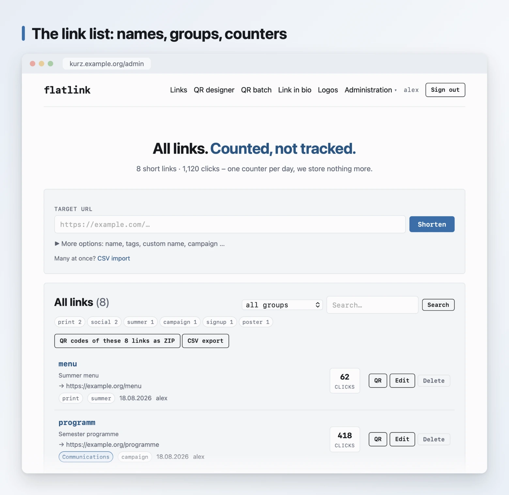
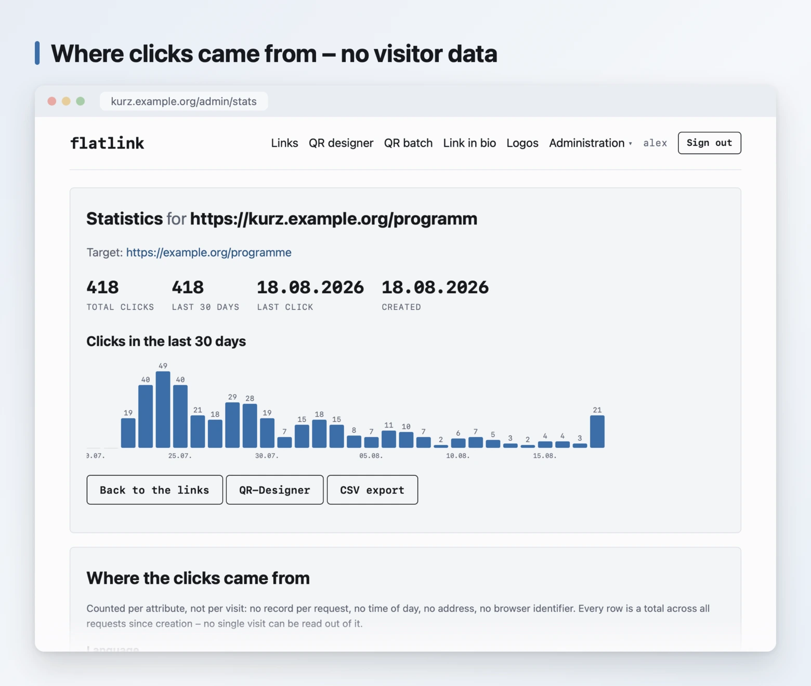
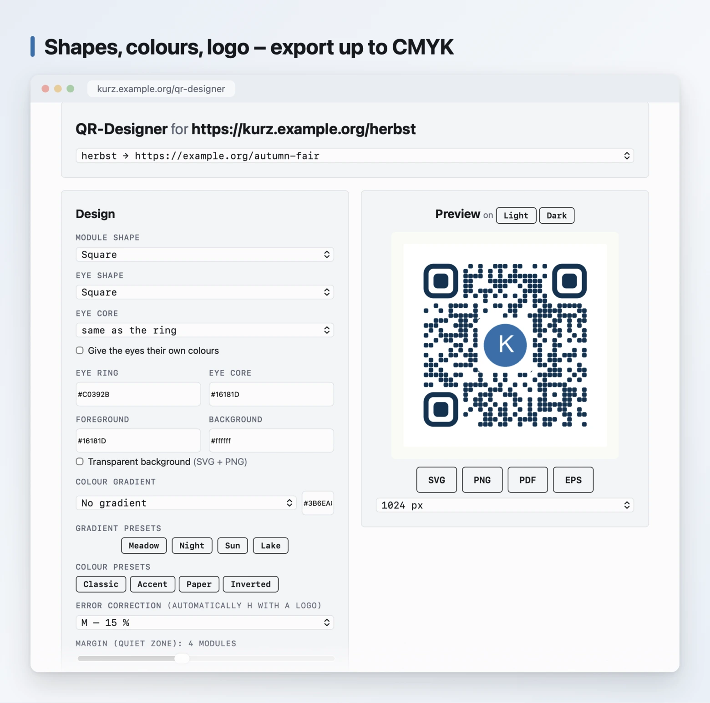
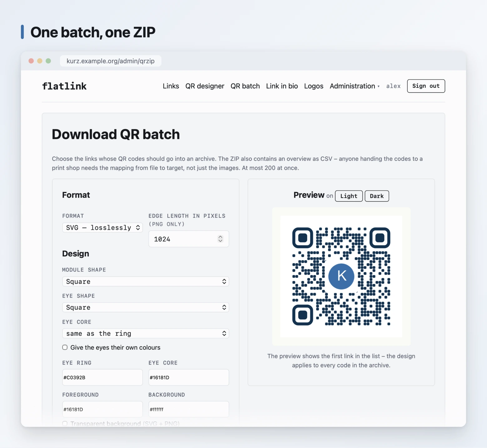
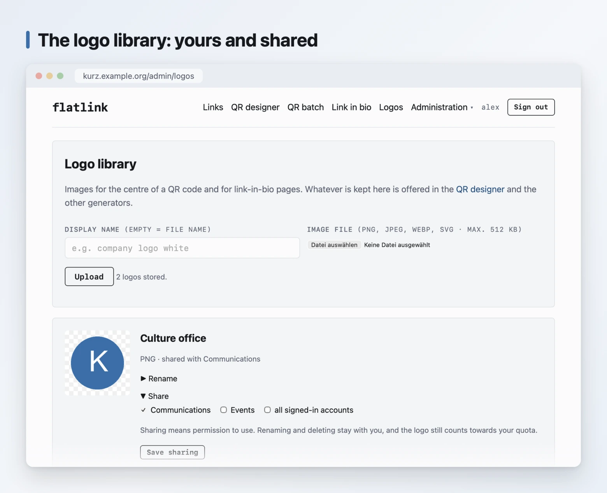
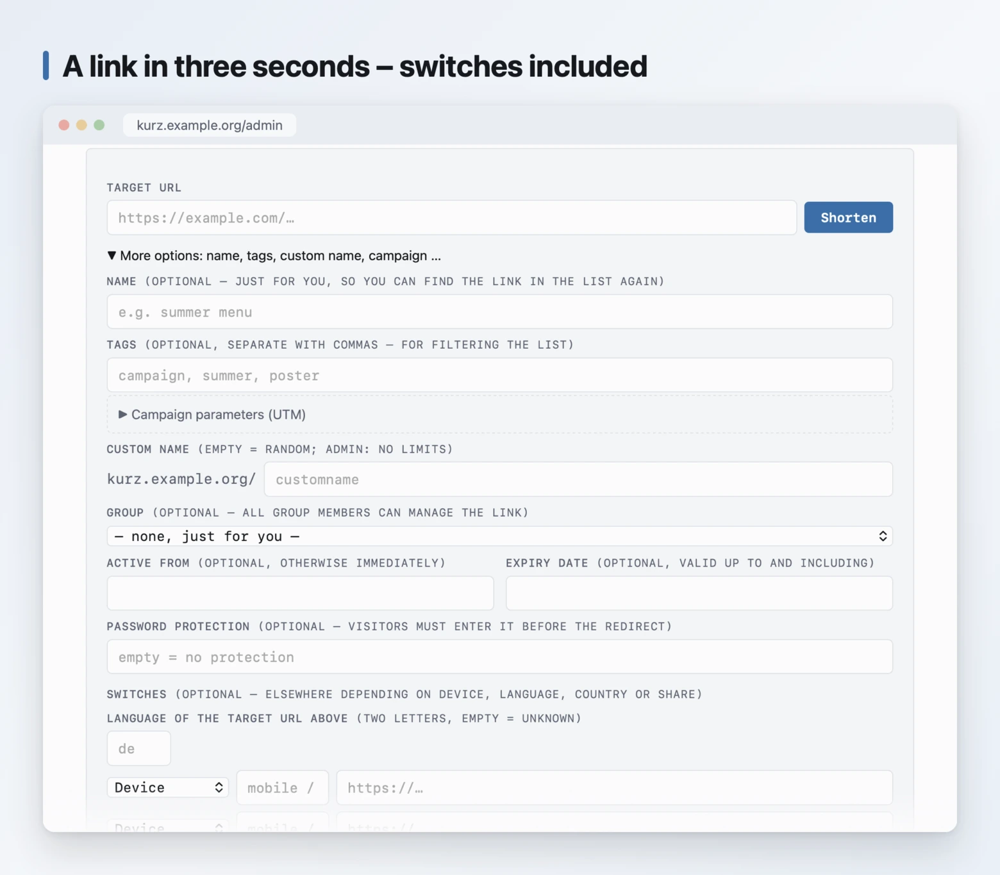
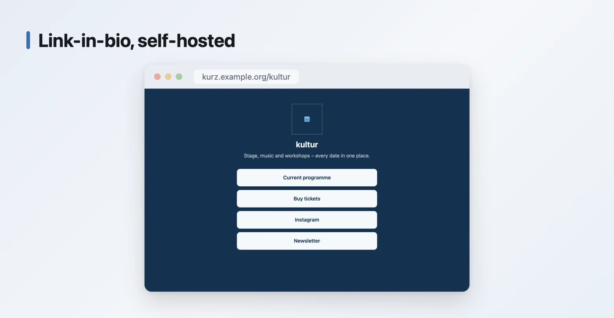

<h1 align="center">flatlink</h1>

<p align="center"> <strong>The self-hosted URL shortener – with a QR
designer and link-in-bio pages.</strong><br> Plain PHP. No database server,
no Composer, no build step –<br> copy the files to your web host and you're
done. </p>

<p align="center"> <a href="LICENSE"></a>    </p>

<p align="center">  </p>

> 🇩🇪 Deutsche Fassung: **[README.de.md](README.de.md)** – German is the project's
> source language; this translation follows it.

---

## The point

flatlink aims to be the best open-source URL shortener you can run yourself
– with a QR generator that goes all the way to the print shop, and
link-in-bio pages. It is built for the places that need such a thing most
urgently: universities, libraries and public bodies that cannot – or must
not – hand their links to an outside service. Sign-in via LDAP and
Shibboleth, groups with permissions and limits, namespaces per department
and multiple domains are therefore not add-ons but the core.

For this purpose, privacy is not a separate feature – it follows from how
the thing is built. Where practically every URL shortener logs **who**
clicks, flatlink stores exactly this per link – in full, not abridged:

```json
{ "n": 1840, "last": "2026-08-14", "days": { "2026-08-14": 72 },
  "refs": { "google.com": 210, "-": 1630 },
  "devs": { "mobile": 1402, "desktop": 438 },
  "langs": { "de": 1701, "en": 139 } }
```

Counters, nothing else. No record of individual visits, hence no IP
addresses and no stored device or browser fingerprints. The lower three
lines answer the most common question asked of any statistic – *where do my
clicks come from?* – without following visitors to do it: three coarse
attributes are derived from each request and **added up**. From the referrer
only the hostname survives (never the path, which can carry a search query),
from the browser identifier one of three words, from the language list two
letters. No single visit can be read out of a total, because no single visit
is ever stored.

For anyone to whom even that is too much: switch it off (`'click_dims' =>
false`) and the first line is all that remains.

Even the last visit is only recorded to the day. For a link with a handful
of clicks, a time of day would otherwise be the single value in the whole
data set by which one visit could be placed in time – and joined with other
sources.

This is not a statement of intent; it can be read in
[`inc/store.php`](inc/store.php) in about ten lines (`clicks_bump()`). Go
check – that is exactly why the code is open. The redirect path (`go.php`)
does not even start a session unless the link is password-protected.

<p align="center">  </p>

## What it looks like

The screenshots show the German interface; the language is switchable per
instance – see [What's included](#whats-included).

<table> <tr> <td width="50%" valign="top"> <a
href="docs/screenshots/en/qr-designer.webp"></a> <p><strong>QR designer.</strong>
Module and eye shapes, free colours, a logo in the middle, a frame with
text. Export as SVG, PNG, vector PDF and EPS, optionally in CMYK – from an
in-house encoder, without any third-party library.</p> <p><strong>Five
types, one generator.</strong> Besides URLs and short links also Wi-Fi
access, contacts (vCard), events (iCalendar) and GS1 Digital Links –
reachable via tabs, with the same design options. These four are static: the
data lives in the code itself, nothing is stored, and they keep working even
without the instance.</p> </td> <td width="50%" valign="top"> <a
href="docs/screenshots/en/qr-batch.webp"></a> <p><strong>QR batches.</strong> Twenty
table tents in one archive, with a CSV overview for the print shop. flatlink
writes the ZIP itself – even without the PHP <code>zip</code> extension.</p>
<a href="docs/screenshots/en/logo-library.webp"></a> <p><strong>Logo library.</strong> Upload
your own logos, rename them and share them with groups – whoever may use one
sees it in the designer and on link-in-bio pages. Sharing means permission
to use, not to manage.</p> </td> </tr> <tr> <td width="50%" valign="top"> <a
href="docs/screenshots/en/new-link.webp"></a> <p><strong>Creating.</strong> Custom name,
a label for your own overview, tags for filtering, expiry date, password
protection and a builder for campaign parameters.</p> </td> <td width="50%"
valign="top" align="center"> <a
href="docs/screenshots/en/link-in-bio.webp"></a> <p align="left"><strong>Link in bio.</strong> One
page with several targets under one short code. Counted like everything
else: per day, for the page and per target, without visitor records.</p>
</td> </tr> </table>

## Running in five minutes

```bash
git clone https://github.com/HerrBarmann/flatlink.git
cd flatlink
cp inc/config.example.php inc/config.php
php -S localhost:8080 router.php
```

Open `http://localhost:8080/admin/` in the browser – the first visit creates
the admin account. (`router.php` emulates for the built-in server what the
`.htaccess` does in production – without it, a short link leads to the start
page instead of its target.) For production: copy the files to your web
host, make `data/` writable, set `base_url` in the configuration. Details
under [Installation](#installation). For an English interface, set
`'language' => 'en'` in `inc/config.php` or switch it later under
*Settings*.

## Who this is for

- **Universities, libraries, schools, public administrations** that must not
  hand short links to a service outside Europe. Sign-in via LDAP or
  Shibboleth, groups with their own permissions and limits, namespaces per
  department.
- **Clubs, practices, restaurants, small businesses** that want to print a
  QR code and change its target later without replacing the sticker.
- **Agencies** serving several brands: separate domains per client, shared
  working groups, an API for automation.
- **Anyone who wants to prove a claim rather than merely assert it.** "We
  don't track" is a claim on a website. With the source code next to it, it
  becomes verifiable.

## Where it runs in production

Whether the software survives everyday use can be checked: the public
service [1337.kiwi](https://1337.kiwi) runs on the same technical base – a
side effect of the project, with its own design and the content a public
offering needs. What holds up in production there ends up in this source;
what is added here for organisations (central sign-in, groups, permissions)
the public service doesn't need.

Installing flatlink does **not give you an imitation of it**: a neutral
theme, your own short codes, your own domain. What remains is a discreet
attribution line in the footer – the [license](#license) requires it, and
that is also all it requires.

## What's included

- **Short links** with random or self-chosen codes, an optional label, tags
  for filtering, **a start date and an expiry date**, and optional password
  protection – a code can be printed and handed out before its target goes
  live
- **QR codes** from an in-house encoder (ISO/IEC 18004, byte mode,
  **versions 1–40**, error correction L/M/Q/H) – without any third-party
  library. Up to 2953 characters, so long addresses with campaign parameters
  fit too
- **QR designer** at `qr-designer.php`: module and eye shapes, free colours,
  **gradients**, **print colours in CMYK**, export as SVG, PNG, **vector PDF
  and EPS**. Signed-in users additionally get their own logo, a frame with
  text and the selection of their links on the same page – a short link can
  be created right there as well
- **Link-in-bio pages**: one page with several targets under one short code,
  counted like everything else – per day, for the page and per target,
  without visitor records
- **Static QR codes** for an **unshortened address or free text**, Wi-Fi
  access, contacts (vCard), events (iCalendar) and **GS1 Digital Link** –
  the input is stored nowhere; it is encoded straight into the graphic, so
  these codes work entirely independently of the service
- **An English interface**: German is the source language, the language is
  set per instance (`'language'` in the configuration or under *Settings*,
  at runtime). Another language is one file under `inc/lang/`; whatever a
  translation lacks stays visibly German instead of blank
- **Accounts** with self-registration via double opt-in, password reset and
  roles (user/admin), including usage limits per account
- **QR codes individually or as a batch in a ZIP**, with a CSV overview
- **Two-factor sign-in**: passkeys (WebAuthn) or one-time passwords from an
  app, with recovery codes, optionally enforceable for the whole instance
- **Data access and deletion in the profile**: data export as JSON and a
  button that really removes the account and its links – GDPR Art. 15, 17
  and 20 without a ticket system
- **Session management in the profile**: a list of active sign-ins, revoke
  one or all others; a password change signs the rest out automatically
- **An audit log of administrative actions**: who blocked, approved or
  changed what and when – administration only, never visitors; JSON lines,
  ready for a central log
- **CSV export of the link list** in the format of the built-in import –
  anyone leaving takes everything with them; lock-in fear is not a business
  model
- **Central sign-in** via LDAP/Active Directory or via the web server
  (Shibboleth, SAML, OpenID Connect) – see [Accounts and
  sign-in](docs/konten.en.md)
- **Groups** in two modes: as a permission group (permissions and limits,
  links stay private) or as a working group whose links the whole team
  manages together
- **CSV import** for many links at once – the exports of Bitly and YOURLS
  can be uploaded unchanged
- **API** with access keys per account, see the [API guide](docs/API.en.md)
- **Abuse protection**: rate limits per IP (only a keyed hash is stored, no
  plain addresses), a report form, a blocking function, optional Google Safe
  Browsing – optionally with a **re-check across the stock**, against
  targets that turn malicious only after creation
- **Backup as an archive**: one button that outputs the database (copied
  consistently), settings, counters and logos as a ZIP with instructions –
  for everyone who cannot access the data directory
- **Automatic cleanup** of never-visited links, with advance warning by mail
  (disabled by default)
- **Storage without operations**: links and accounts in one SQLite file,
  everything else in small JSON files – no database server, backup = copy
  the folder, see [How the data is stored](#how-the-data-is-stored)

## Requirements

- PHP 8.1 or newer
- Extensions: `json`, `mbstring`, `pdo_sqlite` (storage), `gd` (for
  PNG/PDF), `fileinfo` (logo upload), `openssl` (only for SMTP), `ldap`
  (only for LDAP sign-in)
- A web server with `mod_rewrite` or an equivalent rewrite facility. The
  bundled `.htaccess` additionally provides a fallback via `ErrorDocument
  404` in case rewrites don't take effect at your host.

No database server, no Composer, no build step.

## Installation

```bash
git clone https://github.com/HerrBarmann/flatlink.git
cd flatlink
cp inc/config.example.php inc/config.php
```

Then adjust `inc/config.php` (at least `site_name`), put the files into the
webroot and make sure the web server can write to the directory – `data/` is
created on first use.

For a quick try, the built-in server is enough. It does not support
rewrites, hence the bundled router script – it emulates the `.htaccess`
rules so short links and `/api/…` work too:

```bash
php -S localhost:8080 router.php
```

**Prefer a container?** One image, one volume, no database service:

```bash
docker run -d -p 8080:80 -e FLATLINK_BASE_URL="http://localhost:8080" \
  -v flatlink-data:/var/lib/flatlink ghcr.io/herrbarmann/flatlink:latest
```

Details in the [Docker guide](docs/docker.en.md).

**First account:** register via `register.php`. By default, mail delivery is
set to `log`, so the confirmation mail ends up in `data/mail.log` – copy the
link from there and open it. The first account created automatically gets
the admin role.

> **For real operation** there is a detailed
> **[deployment guide](docs/DEPLOYMENT.en.md)**: permissions and web server
> configuration for Apache and nginx, mail delivery including SPF/DKIM/DMARC,
> LDAP and Active Directory, the complete Shibboleth setup including Apache
> and attribute release – plus operation, backup and a table of the most
> common pitfalls.
>
> **Your own colours, your own logo?** See the
> **[customisation guide](docs/CUSTOMIZATION.en.md)** – update-safe via
> `assets/custom.css`, without touching the source.

## Configuration

Everything lives in `inc/config.php`; the commented template is
[`inc/config.example.php`](inc/config.example.php). The most important
switches:

| Option | Meaning |
| --- | --- |
| `site_name` | Display name in title, header and mails |
| `base_url` | Fixed base URL; empty = automatic detection |
| `sqlite_file` | Path of the storage file; empty = `data/flatlink.sqlite` |
| `language` | Interface language of the instance (`de` is the source language, `en` ships along) |
| `limits` | Links, statistics depth and logos per account (`0` = unlimited) |
| `default_perms` | Permissions every signed-in account has without a group |
| `sso` | Central sign-in via the web server (Shibboleth/SAML/OIDC) |
| `ldap` | Sign-in against LDAP or Active Directory |
| `qr_brand_text` | Optional attribution line under generated QR codes |
| `custom_code_min_len` / `custom_code_quota` | Curbs on namespace squatting on public instances |
| `mail` | `log` writes to `data/mail.log`, `smtp` really sends |
| `safe_browsing_key` | Empty = off. See the note below |
| `safety_recheck_days` | Re-check the stock every N days (`0` = off) |
| `link_gc_years` | `0` = no automatic cleanup |
| `data_dir` | Keep runtime data outside the webroot – recommended |
| `trusted_proxies` | Addresses of upstream proxies; needed for correct rate limits |

At runtime, the admin area additionally lets you switch off public link
creation and self-registration – handy when the instance is internal only.

## Manual

The README is the overview; the depth lives in dedicated documents:

| Document | Content |
| --- | --- |
| [The QR generator](docs/qr-generator.en.md) | Encoder, design options, readability check, print export (PDF, EPS, CMYK), batches, GS1 Digital Link |
| [Short links day to day](docs/kurzlinks.en.md) | Tags, campaign parameters, link in bio, migrating from Bitly or YOURLS |
| [Accounts and sign-in](docs/konten.en.md) | Passkeys and one-time passwords, LDAP, Shibboleth/SAML/OIDC, data access and deletion |
| [Groups, permissions and domains](docs/gruppen.en.md) | Permission and working groups, limits, namespaces, multiple domains per instance |
| [Browser extension](extension/README.md) | "shorten this page" for Chrome and Firefox, pointed at your own instance |
| [API](docs/API.en.md) | the API |
| [Deployment](docs/DEPLOYMENT.en.md) | production setup, condensed – the [German guide](docs/DEPLOYMENT.md) is the step-by-step reference |
| [Docker](docs/docker.en.md) | image, environment variables, volume, health endpoint |
| [Customisation](docs/CUSTOMIZATION.en.md) | your own look without changing the core |
| [What flatlink will never do](docs/niemals.md) | the features that will never exist here – and why (German) |
| [Accessibility](docs/barrierefreiheit.en.md) | self-assessment against WCAG 2.1 AA, with a statement template for public bodies |
| [Security](docs/SECURITY.en.md) | what is stored, what is not, and how to report vulnerabilities |

## How the data is stored

**Links and accounts live in one SQLite file** (`data/flatlink.sqlite`).
That is not infrastructure: no server, nothing to set up, nothing to
maintain – the `pdo_sqlite` extension ships with practically every PHP. The
full record sits as JSON in a `data` column; the remaining columns are
derived copies for searching. Measured on an instance with one million links
and a hundred thousand accounts: login page 9 ms, a single account 0.01 ms,
a redirect lookup 0.01 ms – all within PHP's usual memory limit.

Everything else is small JSON files under `data/`, with `flock` against
concurrent writes and atomic writing via temp file plus `rename`:

| File | Content |
| --- | --- |
| `flatlink.sqlite` | Short links, accounts and access keys, see above |
| `clicks/<code>.json` | Click counters – deliberately one mini file per code: the redirect path writes them on every scan, without a shared write lock |
| `groups.json` | Groups: display name and permissions |
| `settings.json` | Settings changeable at runtime |
| `logos/` | Uploaded logos for QR codes |
| `ratelimit/` | Counters per IP hash (HMAC with the instance secret), deleted after 24 h |
| `secret.key` | This instance's secret for the IP hashes – treat like a password |
| `pending/` | Open confirmation tokens (registration, reset) |

A backup therefore remains a simple copy of the `data/` folder – or one
click on *Download backup* in the settings.

**Why not everything lives in the database:** into it goes what grows with
the stock and therefore must not be read in one piece – links, accounts,
access keys. The click counters deliberately stay individual files: they are
written on *every* scan in the redirect path, and a shared write lock would
be the worst possible idea exactly there. The rest – settings, groups, logo
names – is small, constant, and easier to repair in a text file than in a
table.

One honest limit remains: the admin's full list over *millions* of links
still loads the whole stock into memory even with the database – whoever
really gets there raises `memory_limit`. A per-page query is the next step,
when someone needs it.

## What's not included

So nobody goes looking for it: no statistics by country or device – that
follows from the design. Groups share links and permissions but do not
separate tenants from each other: administrators always see everything.

Also not included are **legal notice, privacy policy and terms of service**.
Whoever runs a public instance is obliged, in Germany and large parts of the
EU, to provide such pages themselves – they depend on operator, country and
use, and cannot sensibly be shipped. Create your own pages and link them in
`page_footer()` in [`inc/helpers.php`](inc/helpers.php).

## Tests

No test library, no configuration – two PHP files run against the built-in
server:

```bash
php -S localhost:8080 router.php &
php tests/optionen.php http://localhost:8080
```

[`tests/optionen.php`](tests/optionen.php) checks that every design option
actually arrives at `qr.php`. The occasion was a bug another test could not
find: four module shapes were built in the renderer and offered in the
designer, but the allowlist in `qr.php` didn't recognise them – and an
unknown value is silently reset to the default there. Whoever chose
"diamond" got a square, without a word about it.

The earlier test only asked whether the result **scans**. A code whose shape
was discarded along the way scans just as well – the question was asked
wrongly. Now the same image is produced twice, once through the renderer and
once through the URL, and compared byte by byte.

## Contributing

Bug reports and pull requests are welcome. One request up front: the freedom
from dependencies is not an accident but the core of the project. A patch
that requires Composer, a build step or a database *server* will not be
merged – even if it makes things more elegant. (SQLite passes this test: one
file under `data/`, no infrastructure.)

## License

**[GNU AGPL v3](LICENSE)** with an additional attribution term under section
7(b) of the license. What that means in practice:

**Allowed without asking** – commercially too, for paying customers too: use
it, run it yourself, change it, pass it on, rename it, restyle it, extend it
for your own purposes.

**Two conditions:**

1. **The attribution line stays visible.** Every interface must point to
   "flatlink" and link to <https://1337.kiwi/flatlink>. Translating,
   rephrasing, setting it small and discreet – all allowed. Hiding or
   removing it is not. The reference point is `origin_note()` in
   [`inc/helpers.php`](inc/helpers.php).
2. **Changes stay open.** Whoever offers a *modified* version as a network
   service must make the source of that version available to its users (AGPL
   § 13). Whoever runs it unmodified doesn't have to publish anything.

Why not MIT: because MIT allows closing the source and building a service
from it where nobody can check anymore what happens to the click data. The
whole point of this project is that you can check.

For a version without the attribution line – say, white-label – there is a
written exemption: <dennis@1337.hamburg>.
